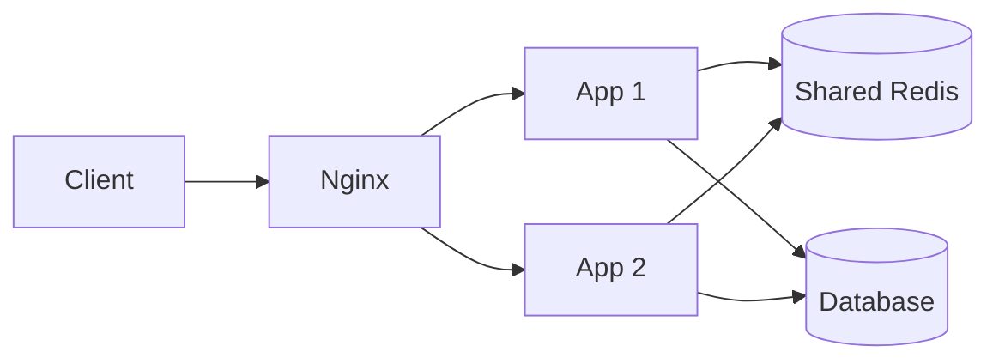

# 01 — Scaling và load balancing

## Mục tiêu

Phân biệt scale up/out, giải thích state nằm ở đâu và kiểm chứng failover. Bắt đầu từ một app và một database; chỉ thêm node khi phép đo xác định bottleneck hoặc yêu cầu availability cần dự phòng.

## Scale up và scale out

| Lựa chọn | Lợi ích | Giới hạn |
|---|---|---|
| Scale up | Ít thay đổi code, nâng CPU/RAM/I/O một node | Giới hạn phần cứng, downtime tùy nền tảng, không tự có HA |
| Scale out | Tăng số node, chia tải và triển khai từng node | State/routing/concurrency phức tạp; bottleneck chia sẻ vẫn tồn tại |

Chi phí không luôn tuyến tính hay phi tuyến: phụ thuộc cloud SKU, storage, network và vận hành. Định luật Amdahl nhắc rằng phần tuần tự giới hạn tốc độ tăng; thêm app không giải quyết hot row trong DB. Với Node.js, nhiều tiến trình có thể tận dụng nhiều CPU core cho tác vụ CPU-bound; trên một máy bị quota CPU, 3 node không bảo đảm tăng 3 lần.

## State và stateless app

Stateless app không giữ state nghiệp vụ cần thiết cho request sau trong RAM riêng của node. State vẫn tồn tại ở database, cache hoặc object store. Counter, session và giỏ hàng cục bộ có thể bị chia thành nhiều bản khác nhau qua LB và mất khi restart.

Stateful hệ thống vẫn scale được bằng partitioning, replication và routing theo owner; WebSocket cũng có connection state trên node. Sticky session là lựa chọn có chi phí về cân tải/failover, không tự giải quyết durability. Externalize state giúp app scale dễ hơn nhưng thêm dependency, latency và failure modes.

## L4/L7 và thuật toán

L4 route kết nối TCP/UDP theo transport; L7 hiểu HTTP path/header và có thể terminate TLS. TLS parsing và HTTP routing có chi phí; mức chênh lệch phải đo theo workload.

Round robin phù hợp node/workload gần đồng đều; weighted round robin khi năng lực khác nhau; least connections hữu ích khi connection duration khác nhau; IP hash có nguy cơ lệch tải do NAT. Connection ít không đồng nghĩa CPU ít; cần đo active requests, service time và saturation.

## Health và failover

Active check chủ động probe backend; passive check quan sát request thật. Nginx lab dùng passive checks và Compose readiness khi startup; có failure window trước khi node lỗi bị loại. Liveness không kiểm tra mọi DB connection vì lỗi dependency không có nghĩa tiến trình cần bị restart.

Retry GET có thể chuyển node; POST đã ghi nhưng timeout không được retry tùy tiện. Idempotency giải quyết kết quả chưa biết ở client; không chỉ dùng method name để kết luận mọi nghiệp vụ an toàn.

Một node chết làm tải dồn lên node còn lại; cần headroom, timeout, backpressure và admission control để tránh cascade. Nginx và DB một instance vẫn là SPOF; thêm app replicas chưa đủ để có HA toàn hệ thống.

## Lab và tự đánh giá

[Lab 01](../labs/module-01-load-balancing/) dùng 3 app node, Nginx và Redis thật. Counter local minh họa state lệch; counter chung giữ đủ 60 increment; stop một app rồi kiểm tra GET qua gateway. So sánh benchmark trực tiếp :3001 với :8080 cùng workload và concurrency; báo CPU quota và error rate.

Bài tập: app giữ session trên node A, A chết sau khi trả response. Thiết kế recovery và nêu độ trễ/chi phí của shared session store. Tiêu chí đạt: phân biệt app stateless với storage stateful, chỉ ra SPOF và không coi container là máy chủ độc lập.

Nguồn: [Nginx HTTP load balancing](https://nginx.org/en/docs/http/load_balancing.html), [proxy retry](https://nginx.org/en/docs/http/ngx_http_proxy_module.html#proxy_next_upstream).
