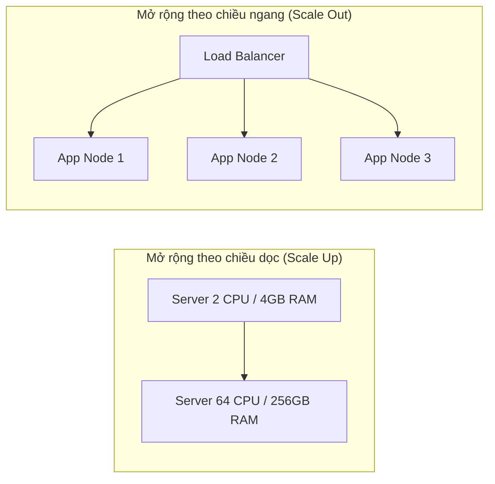
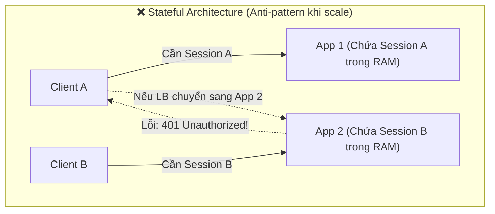
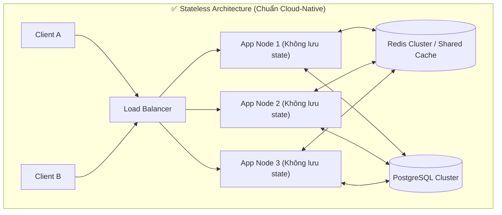
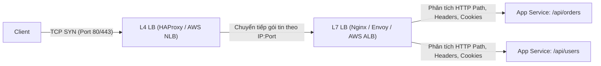
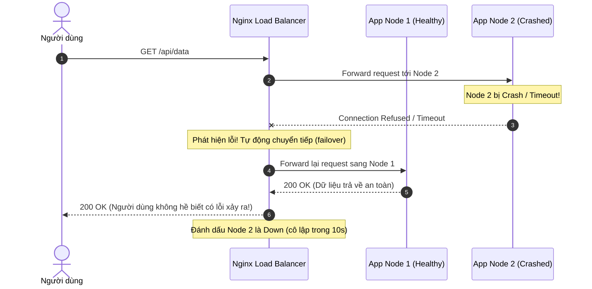

# CHUYÊN ĐỀ 01: MỞ RỘNG HỆ THỐNG & CÂN BẰNG TẢI (SCALING & LOAD BALANCING)

> **Mục tiêu cấp độ Senior / Architect**: Hiểu rõ bản chất toán học và vật lý của việc mở rộng hệ thống, sự khác biệt sống còn giữa Stateless và Stateful, cơ chế hoạt động của các thuật toán Load Balancing (L4 vs L7), và cách thiết kế cơ chế tự phục hồi (Self-Healing / Failover) chống sập domino (Cascading Failure).

---

## 1. Mở rộng Hệ thống: Vertical Scaling vs. Horizontal Scaling

Khi một hệ thống phần mềm bắt đầu quá tải (CPU chạm ngưỡng 90%, RAM cạn kiệt, độ trễ p99 tăng vọt), có hai chiến lược mở rộng:

### So sánh chuyên sâu

| Tiêu chí | Scale Up (Vertical) | Scale Out (Horizontal) |
| :--- | :--- | :--- |
| **Bản chất** | Nâng cấp CPU, RAM, SSD NVMe của 1 máy chủ vật lý / VM duy nhất | Bổ sung thêm nhiều máy chủ nhỏ chạy song song |
| **Giới hạn phần cứng** | Có trần vật lý (Hardware Ceiling). Không có máy chủ nào vô hạn CPU/RAM. | Về mặt lý thuyết là không giới hạn |
| **Độ phức tạp code** | Đơn giản, không cần sửa đổi kiến trúc ứng dụng (vẫn là 1 monolith) | Phức tạp: Ứng dụng **bắt buộc phải là Stateless**, xử lý concurrency, split-brain |
| **Độ sẵn sàng (Availability)** | Rất kém. **Single Point of Failure (SPOF)**. Bảo trì/khởi động lại máy = Down toàn bộ hệ thống | Rất cao. Có dự phòng $N+1$ hoặc $2N$. Một máy chết, các máy khác gánh tải |
| **Chi phí kinh tế** | Tăng theo cấp số nhân (Non-linear cost). 1 VM 64 lõi đắt hơn rất nhiều so với 8 VM 8 lõi | Tăng tuyến tính (Linear cost). Dễ dàng tận dụng Spot Instances hoặc Autoscaling |
| **Thời gian Downtime** | Thường yêu cầu tắt máy để nâng cấp phần cứng | Zero Downtime (Rolling Deployment, Blue/Green) |

> [!IMPORTANT]
> **Định luật Amdahl (Amdahl's Law)**: Việc tăng thêm CPU trên cùng một máy chỉ tăng tốc hệ thống đến một giới hạn nhất định, bị kìm hãm bởi phần code chạy tuần tự (Serial execution / Locks / Memory Bus Contention). Vì vậy, Scale Out là con đường duy nhất để phục vụ hàng trăm ngàn đến hàng triệu người dùng đồng thời.

---

## 2. Stateless vs. Stateful Architecture

Đây là nguyên tắc tiên quyết của việc mở rộng theo chiều ngang: **Một ứng dụng chỉ có thể Scale Out dễ dàng khi và chỉ khi nó là Stateless (Phi trạng thái)**.

### Tại sao Stateful phá vỡ khả năng mở rộng?
1. **Sticky Session (Session Affinity)**: Load Balancer buộc phải ghim IP người dùng vào đúng máy chủ ban đầu. Khi một "khách sộp" hoặc bot gửi nhiều request, máy chủ đó sẽ bị quá tải trong khi các máy khác nhàn rỗi.
2. **Khó Scale In / Out**: Khi muốn giảm tải để tiết kiệm tiền hoặc triển khai phiên bản code mới, ta không thể tắt node nếu node đó đang giữ session của người dùng trong RAM.
3. **Mất mát dữ liệu khi Crash**: Nếu App 1 bị sập, toàn bộ session, giỏ hàng của hàng ngàn người dùng trên App 1 sẽ bốc hơi ngay lập tức.

### Nguyên tắc Stateless:
* Mọi thông tin trạng thái (User Session, JWT Blacklist, Temporary Files, WebSocket state) phải được **đẩy ra ngoài (Externalize)** vào các tầng lưu trữ chuyên dụng: **Redis, Memcached, S3/MinIO, hoặc Database**.
* Bất kỳ node nào trong cluster cũng có thể xử lý bất kỳ request nào từ bất kỳ client nào mà kết quả trả về không đổi.

---

## 3. Cân bằng Tải (Load Balancing): Phân tầng & Thuật toán

Load Balancer (LB) là thiết bị hoặc phần mềm đứng giữa client và backend servers, phân phối lưu lượng truy cập để không máy chủ nào bị quá tải.

### 3.1. Layer 4 (L4) vs. Layer 7 (L7) Load Balancing

| Đặc điểm | Layer 4 (Transport Layer) | Layer 7 (Application Layer) |
| :--- | :--- | :--- |
| **Giao thức** | TCP / UDP | HTTP, HTTPS, HTTP/2, gRPC, WebSocket |
| **Mức độ hiểu dữ liệu** | Chỉ nhìn IP nguồn, IP đích và Port. **Không đọc nội dung gói tin**. | Đọc và giải mã toàn bộ HTTP Header, URL Path, Cookie, Body. |
| **Hiệu năng & Tốc độ** | Cực nhanh, tiêu tốn rất ít CPU/RAM. Thông lượng hàng triệu packet/s. | Chậm hơn L4 do phải giải mã SSL/TLS và parse HTTP request. |
| **Độ thông minh** | Thấp. Chỉ forward packet thuần túy. | Rất cao: Định tuyến theo URL (`/api/pay` sang cụm riêng), kiểm tra header, chặn header độc hại, nén gzip, rate limit. |
| **Ví dụ đại diện** | AWS NLB, HAProxy (TCP mode), Linux LVS | Nginx, Envoy Proxy, Traefik, AWS ALB |

---

### 3.2. Các Thuật toán Cân bằng Tải (Load Balancing Algorithms)

#### 1. Round Robin
* **Nguyên lý**: Phân bổ lần lượt theo vòng tròn: $S_1 \rightarrow S_2 \rightarrow S_3 \rightarrow S_1 \rightarrow S_2 \dots$
* **Ưu điểm**: Thuật toán đơn giản nhất, chi phí tính toán là $O(1)$.
* **Nhược điểm**: Giả định rằng mọi request đều tốn tài nguyên như nhau và mọi máy chủ đều có sức mạnh bằng nhau. Trong thực tế, nếu Request A tính toán thuật toán nặng 2 giây, còn Request B lấy dữ liệu tĩnh 2 mili-giây, máy nhận nhiều Request A sẽ bị nghẽn (skewed load).

#### 2. Weighted Round Robin
* **Nguyên lý**: Gán trọng số $W_i$ cho từng máy chủ dựa trên năng lực phần cứng. Máy mạnh nhận nhiều request hơn máy yếu.
* **Ví dụ**: Server 1 (8 CPU, weight=3), Server 2 (4 CPU, weight=1) $\rightarrow$ Cứ 4 request sẽ có 3 vào Server 1 và 1 vào Server 2.

#### 3. Least Connections
* **Nguyên lý**: Chuyển request đến máy chủ đang có số lượng kết nối tích cực (Active Connections) ít nhất tại thời điểm đó.
* **Khi nào nên dùng?**: Cực kỳ hiệu quả cho các kết nối dài (Long-lived connections) như **WebSockets, SSE (Server-Sent Events), Database Queries phức tạp, hoặc File Upload/Download**.

#### 4. IP Hash
* **Nguyên lý**: Lấy mã băm (Hash) của địa chỉ IP client modulo cho số lượng server:
  $$\text{Target Server} = \text{hash}(\text{Client IP}) \pmod N$$
* **Ứng dụng**: Giúp đảm bảo cùng 1 client luôn được điều hướng đến cùng 1 máy chủ (nếu cần session cache cục bộ).
* **Nhược điểm lớn**: Nếu hàng ngàn người dùng cùng chung 1 mạng công ty hoặc trường đại học (thông qua NAT / Proxy gateway), tất cả request sẽ đổ dồn vào đúng 1 máy chủ duy nhất, gây sập máy.

---

## 4. Cơ chế Giám sát Sức khỏe (Health Checks) & Tự phục hồi (Failover)

Một Load Balancer không chỉ chia việc, mà còn phải là "vệ sĩ" bảo vệ hệ thống khỏi những node đã chết hoặc sắp chết.

### Active vs. Passive Health Check
1. **Active Health Check (Chủ động)**:
   * Định kỳ (ví dụ mỗi 5 giây), LB gửi request `GET /health` đến từng node backend.
   * Nếu node trả về `200 OK` trong vòng timeout (ví dụ 1000ms), node được xem là sống (`Healthy`).
   * Nếu node fail liên tiếp $M$ lần (ví dụ 3 lần), LB lập tức rút node này ra khỏi danh sách định tuyến (`Unhealthy`).
2. **Passive Health Check (Thụ động)**:
   * LB theo dõi trực tiếp các request của người dùng thật.
   * Nếu request gửi đến một node bị timeout hoặc trả về lỗi `502/504 Bad Gateway`, LB sẽ tự động thử lại (Retry) trên một node khác ngay lập tức và tạm thời ngưng gửi request đến node lỗi trong một khoảng thời gian (`fail_timeout`).

> [!WARNING]
> **Hiệu ứng Thùng sập (Cascading Failure / Domino Effect)**:
> Giả sử hệ thống đang chịu tải 10,000 req/s chia đều cho 4 máy (mỗi máy gánh 2,500 req/s, vừa khít công suất 90%).
> Nếu 1 máy bị sập vì nghẽn RAM, 3 máy còn lại sẽ phải gánh 3,333 req/s $\rightarrow$ vượt quá ngưỡng chịu đựng và sập tiếp máy thứ 2 $\rightarrow$ 2 máy còn lại chịu 5,000 req/s và sập toàn bộ hệ thống trong tích tắc!
> **Giải pháp kiến trúc**: Phải thiết lập **Rate Limiter (Chuyên đề 03)**, **Circuit Breaker** và luôn dự phòng dung lượng dư thừa ($N+1$ hoặc tối đa tải cho phép ở mức 60-70%).

---

## 5. Tóm tắt Tiêu chuẩn Thiết kế (Architectural Checklist)

1. [ ] **Mọi dịch vụ Backend phải là Stateless**: Đẩy Session và Cache sang Redis.
2. [ ] **Luôn có ít nhất 2 Replicas ($N \ge 2$) cho mỗi service**: Tuyệt đối không để Single Point of Failure.
3. [ ] **Cấu hình Health Checks rõ ràng**: Cung cấp endpoint `/health` kiểm tra cả kết nối Database/Redis nội bộ (Deep Health Check).
4. [ ] **Kích hoạt cơ chế Retry an toàn**: Chỉ retry đối với các request Idempotent (`GET`, `PUT`, `DELETE` an toàn), cẩn trọng khi retry `POST` thanh toán nếu chưa có Idempotency Key!
5. [ ] **Thiết lập Timeout nghiêm ngặt**: Không bao giờ để kết nối chờ vô hạn (Connection Timeout và Read Timeout tối đa 2-5 giây).
