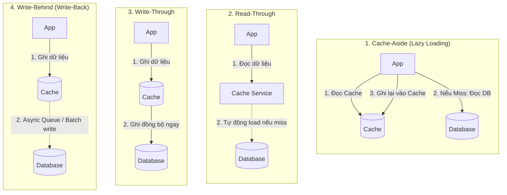
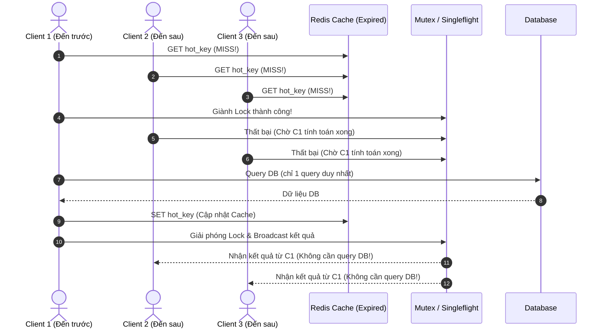

# CHUYÊN ĐỀ 02: CHIẾN LƯỢC CACHING CHUYÊN SÂU & PHÒNG THỦ SỰ CỐ CACHE KINH ĐIỂN

> **Mục tiêu cấp độ Senior / Architect**: Nắm vững bản chất vật lý của bộ nhớ, phân biệt và lựa chọn chính xác giữa 4 chiến lược Caching (Cache-Aside, Read-Through, Write-Through, Write-Behind), làm chủ các thuật toán giải phóng bộ nhớ (LRU, LFU), và thiết kế các giải pháp phòng thủ triệt để trước 3 thảm họa sản xuất: **Cache Penetration (Thủng Cache)**, **Cache Breakdown / Thundering Herd (Vỡ Cache)**, và **Cache Avalanche (Tuyết lở Cache)**.

---

## 1. Bản chất Vật lý & Tại sao Caching là Vũ khí Tối thượng?

Trong kiến trúc máy tính và hệ thống phân tán, sự chênh lệch tốc độ giữa các tầng lưu trữ (Storage Hierarchy) là rất lớn:

| Tầng lưu trữ | Thiết bị đại diện | Độ trễ truy xuất (Latency) | So sánh tương đối |
| :--- | :--- | :--- | :--- |
| **CPU L1 Cache** | On-chip SRAM | ~0.5 - 1 ns | Nhanh như chớp mắt (1 giây của con người) |
| **CPU L2/L3 Cache** | On-chip SRAM | ~3 - 10 ns | Vài giây |
| **RAM (Bộ nhớ trong)** | DDR4 / DDR5 (Redis, Memcached) | **~50 - 100 ns** | ~1.5 phút |
| **SSD NVMe (Flash)** | SSD Storage | ~10 - 50 $\mu$s | ~1.5 ngày |
| **RDBMS Disk I/O** | HDD / Database B-Tree Read | **~1 - 10 ms** | **~3 - 4 tháng!** |
| **Network Roundtrip** | Internet / Multi-datacenter | ~20 - 100 ms | Vài năm! |

> [!IMPORTANT]
> **Định luật 80/20 (Pareto Principle)**: Trong hầu hết các hệ thống thực tế, **80% lưu lượng truy cập chỉ tập trung vào 20% dữ liệu hot** (ví dụ: các sản phẩm trang chủ, thông tin người dùng đang online, bảng xếp hạng).
> Đưa 20% dữ liệu này lên RAM (Redis / In-memory) giúp giảm tải cho Database từ 10 đến 100 lần và kéo độ trễ từ vài chục mili-giây xuống dưới 1 mili-giây.

---

## 2. Bốn Chiến lược Caching Cơ bản (Caching Patterns)

### So sánh Chuyên sâu & Phân tích Đánh đổi (Trade-offs)

| Chiến lược | Cơ chế hoạt động | Ưu điểm | Nhược điểm / Rủi ro | Khi nào nên dùng? |
| :--- | :--- | :--- | :--- | :--- |
| **Cache-Aside (Lazy Loading)** | App trực tiếp kiểm tra Cache. Nếu Miss thì tự query DB và ghi ngược vào Cache. | • Tiết kiệm RAM: Chỉ dữ liệu được query mới lưu vào cache. • Phục hồi nhanh: Nếu Cache sập, App vẫn gọi được DB. | • Lần đọc đầu tiên luôn bị chậm (Cache Miss Penalty). • Dữ liệu có thể bị cũ (Stale Data) nếu DB thay đổi mà không xóa cache. | **Chuẩn mực phổ biến nhất cho 90% ứng dụng web thông thường.** |
| **Read-Through** | App chỉ tương tác với Cache Provider. Cache Provider chịu trách nhiệm tự lấy từ DB nếu Miss. | • Đơn giản hóa code của ứng dụng. • Mô hình hóa dữ liệu thống nhất. | • Cần thư viện/middleware hỗ trợ adapter trực tiếp với DB. | Khi dùng các hệ thống cache chuyên dụng (như AWS DAX cho DynamoDB). |
| **Write-Through** | App ghi vào Cache, Cache lập tức ghi đồng bộ vào Database trước khi báo thành công. | • Dữ liệu trong Cache luôn mới nhất, không bao giờ bị Stale. • Đảm bảo tính nhất quán cao. | • Độ trễ ghi (Write Latency) cao vì phải chờ 2 thao tác I/O hoàn tất. • Tốn RAM lưu dữ liệu ít khi được đọc lại. | Ứng dụng yêu cầu tính nhất quán tức thì (Financial, Inventory balance). |
| **Write-Behind (Write-Back)** | App ghi vào Cache và nhận phản hồi ngay. Cache gom lô (Batch) ghi bất đồng bộ xuống DB sau. | • **Tốc độ ghi cực kỳ nhanh** (vài micro-giây). • Giảm tải tối đa cho DB nhờ gom nhóm thao tác ghi (Write Coalescing). | • **Rủi ro mất dữ liệu (Data Loss)**: Nếu máy chủ Cache bị sập điện trước khi kịp ghi vào DB. • Phức tạp trong xử lý xung đột (Conflict resolution). | Đếm lượt xem (View Counter), Analytics, Nhật ký thao tác (Audit log), Like/Reaction. |

---

## 3. Chính sách Giải phóng Bộ nhớ (Cache Eviction Policies)

Khi RAM của Redis/Cache đầy đến ngưỡng cấu hình (`maxmemory`), hệ thống buộc phải giải phóng dữ liệu theo một trong các thuật toán:

1. **LRU (Least Recently Used - Ít được sử dụng gần đây nhất)**:
   * **Nguyên lý**: Loại bỏ key có thời gian truy cập gần nhất cách xa thời điểm hiện tại nhất.
   * **Triển khai chuẩn**: Sử dụng cấu trúc dữ liệu kết hợp giữa **Doubly Linked List** (danh sách liên kết đôi) và **Hash Map** để đạt độ phức tạp thời gian $O(1)$ cho cả thao tác `get` và `put`.
2. **LFU (Least Frequently Used - Ít được sử dụng thường xuyên nhất)**:
   * **Nguyên lý**: Đếm tần suất (frequency counter) của từng key. Key nào có số lần được đọc ít nhất sẽ bị loại bỏ.
   * **Khác biệt với LRU**: Nếu một key vừa được đọc cách đây 5 phút nhưng trong quá khứ được truy cập 1 triệu lần, LRU có thể xóa nó nếu có một đợt quét dữ liệu lạ (Cache scan), còn LFU sẽ giữ lại vì tần suất lịch sử của nó rất cao.
3. **FIFO (First In First Out)**: Xóa theo thứ tự nhập trước xuất trước (đơn giản nhưng ít tối ưu).
4. **Random**: Xóa ngẫu nhiên một key để giải phóng không gian (nhanh, tốn ít CPU).

---

## 4. Ba Cơn Ác Mộng Kinh Điển của Caching & Giải Pháp Phòng Thủ

Đây là 3 câu hỏi phỏng vấn System Design cốt lõi và là 3 sự cố thường xuyên "đánh sập" hệ thống trong thực tế.

```mermaid
flowchart TD
    subgraph Nightmare1["1. Cache Penetration (Thủng Cache)"]
        Req1["Hacker / Bot"] -->|"Query ID không tồn tại: id = -999"| C_Miss1["Cache MISS"]
        C_Miss1 -->|"100% Request đổ thẳng vào DB"| DB_Crash1["Database Quá Tải / Crash!"]
    end

    subgraph Nightmare2["2. Cache Breakdown / Thundering Herd (Vỡ Cache)"]
        Req2["10,000 req/s cùng lúc"] -->|"HOT KEY vừa hết hạn TTL lúc t=0"| C_Miss2["Cache MISS đồng loạt"]
        C_Miss2 -->|"10,000 queries cùng lao vào DB"| DB_Crash2["Database 100% CPU / Spike!"]
    end

    subgraph Nightmare3["3. Cache Avalanche (Tuyết Lở Cache)"]
        Req3["Toàn bộ người dùng"] -->|"Hàng ngàn keys cùng expire tại 00:00:00"| C_Miss3["Cache RỖNG đồng loạt"]
        C_Miss3 -->|"Lượng request khổng lồ đập vào DB"| DB_Crash3["Database Sập Toàn Bộ!"]
    end
```

---

### 4.1. Sự cố 1: Cache Penetration (Thủng Cache)

* **Hiện tượng**: Người dùng hoặc hacker cố tình gửi các request truy vấn các tài nguyên **hoàn toàn không tồn tại** trong cơ sở dữ liệu (ví dụ: `GET /api/users/-1` hoặc random UUIDs hàng loạt).
* **Hậu quả**: Vì dữ liệu không có trong DB nên Cache không có gì để lưu. Mọi request tiếp theo với ID đó tiếp tục bỏ qua Cache và đâm thẳng vào Database $\rightarrow$ DB bị quá tải I/O.
* **Giải pháp phòng thủ**:
  1. **Cache Null Object (Lưu kết quả rỗng)**:
     * Khi DB trả về `null` hoặc không tìm thấy, ta vẫn lưu vào Cache một bản ghi rỗng `{ id: -1, data: null }` kèm một **TTL ngắn (ví dụ: 30 - 60 giây)**.
     * Request tiếp theo trong vòng 60 giây sẽ nhận kết quả rỗng ngay từ Cache mà không chạm vào DB.
  2. **Bloom Filter (Bộ lọc Bloom)**:
     * Cấu trúc dữ liệu xác suất (Probabilistic Data Structure) cực kỳ tiết kiệm bộ nhớ: có thể kiểm tra xem một phần tử **chắc chắn không tồn tại** hay **có thể tồn tại** trong tập dữ liệu với độ phức tạp $O(1)$.
     * Mọi request phải đi qua Bloom Filter trước: Nếu Bloom Filter báo "Key này chắc chắn không tồn tại", hệ thống trả về 404 ngay lập tức mà không cần hỏi Cache hay DB!

---

### 4.2. Sự cố 2: Cache Breakdown / Thundering Herd / Cache Stampede (Vỡ Cache)

* **Hiện tượng**: Một **Hot Key** (ví dụ: thông tin sự kiện Flash Sale iPhone, bài viết của người nổi tiếng) đang có lưu lượng truy cập cực cao (ví dụ: 10,000 req/s). Đúng vào thời điểm $t$, key này **hết hạn TTL** trong cache.
* **Hậu quả**: Trong cùng 1 tích tắc (mili-giây), hàng ngàn request cùng nhận kết quả `Cache Miss` và đồng loạt thực hiện truy vấn DB để tính toán và cập nhật lại cache. Database bị sốc tải tức thì, nghẽn connection pool và sập (Thundering Herd Problem).
* **Giải pháp phòng thủ chuyên sâu**:

#### Giải pháp A: Mutex Lock / Singleflight Pattern (Khuyên dùng)
Chỉ cho phép **duy nhất 1 request đầu tiên** giành được Lock (khóa) để truy vấn Database và cập nhật Cache. Tất cả các request khác đến sau sẽ đợi kết quả của request đầu tiên hoặc đọc dữ liệu vừa được cập nhật.

#### Giải pháp B: Thuật toán Làm mới Sớm Ngẫu nhiên (Probabilistic Early Expiration / XFetch)
Thay vì chờ key hết hạn hẳn mới tính lại, ta tính toán một công thức xác suất dựa trên thời gian tính toán DB $\beta$, delta thời gian còn lại đến TTL và một biến ngẫu nhiên. Khi key sắp hết hạn, một request ngẫu nhiên sẽ chủ động tính toán lại và làm mới cache ngầm (Background Refresh) trước khi sự cố hết hạn xảy ra!

---

### 4.3. Sự cố 3: Cache Avalanche (Tuyết lở Cache)

* **Hiện tượng**: Hàng loạt key (ví dụ: hàng trăm ngàn sản phẩm) được nạp vào cache cùng một thời điểm với **cùng một giá trị TTL cố định** (ví dụ: đúng 1 giờ).
* **Hậu quả**: Khi đồng hồ điểm đủ 1 giờ, toàn bộ các key này cùng bốc hơi khỏi cache trong cùng một giây. Hệ thống đột ngột rơi vào tình trạng "Zero Cache", toàn bộ lưu lượng của người dùng ập thẳng vào Database như tuyết lở.
* **Giải pháp phòng thủ**:
  * **TTL Jitter (Thêm độ lệch ngẫu nhiên)**:
    Tuyệt đối không bao giờ để TTL là một hằng số cố định! Hãy cộng thêm một khoảng ngẫu nhiên (Jitter):
    $$\text{Actual TTL} = \text{Base TTL} + \text{random}(0, \text{Jitter Range})$$
    *Ví dụ: Thay vì đặt cứng TTL = 3600 giây (1 giờ), hãy đặt $\text{TTL} = 3600 + \text{random}(0, 300)$ giây. Các key sẽ hết hạn rải rác từ 60 phút đến 65 phút, triệt tiêu hoàn toàn hiệu ứng tuyết lở!*
  * **Xây dựng cụm Cache có độ sẵn sàng cao (High Availability)**: Sử dụng Redis Sentinel hoặc Redis Cluster với Master-Replica để đảm bảo nếu một node cache sập, node khác lập tức thế chỗ (failover).

---

## 5. Chiến lược Xóa Cache & Tính Nhất Quán (Cache Invalidation)

Khi cập nhật dữ liệu vào Database, thứ tự thao tác giữa DB và Cache như thế nào để tránh dữ liệu bị sai lệch (Inconsistent Data)?

> [!CAUTION]
> **Anti-Pattern**: Xóa Cache trước, Cập nhật DB sau.
> * Luồng lỗi: Thread A xóa Cache $\rightarrow$ Thread B vào đọc thấy Cache rỗng liền đọc DB (vẫn mang giá trị cũ) và ghi giá trị cũ vào Cache $\rightarrow$ Thread A cập nhật DB xong.
> * Kết quả: Cache vĩnh viễn chứa dữ liệu cũ sai lệch (Dirty Data)!

### ✅ Quy tắc Vàng: Cập nhật DB trước, Xóa Cache sau (Update DB, then Delete Cache)
1. Thực hiện câu lệnh `UPDATE` hoặc `INSERT` thành công vào Cơ sở dữ liệu.
2. Thực hiện lệnh `DEL key` trên Cache (Xóa chứ không nên ghi đè, để lần đọc tiếp theo tự nạp lại qua Cache-Aside).
3. Kết hợp với **TTL ngắn** để đảm bảo nếu bước xóa cache gặp sự cố mạng, dữ liệu sai lệch cũng sẽ tự động được làm sạch sau một khoảng thời gian nhất định (Eventual Consistency).
