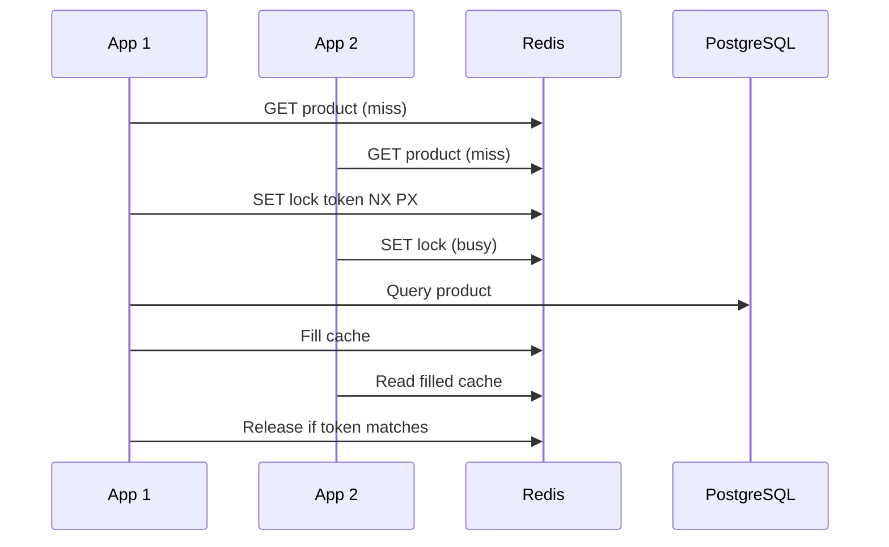

# 02 — Cache, invalidation và stampede

## Mục tiêu

Chọn cache theo workload, đo query giảm được và xác định stale window. Cache là bản sao dẫn xuất trừ khi hệ thống được thiết kế rõ để nó làm nguồn dữ liệu chuẩn; latency truy cập RAM không phải latency một Redis request qua mạng.

## Các pattern

| Pattern | Ai load/ghi dữ liệu? | Trade-off |
|---|---|---|
| Cache-aside | App đọc cache; miss đọc DB rồi fill | Đơn giản, miss chậm; invalidation và concurrency có thể tạo stale |
| Read-through | Cache provider tự load nguồn | Giảm logic trong app, cần adapter và failure policy |
| Write-through | Provider đồng bộ cache và nguồn trước ACK | Tăng write latency; không tự bảo đảm consistency nếu lỗi từng phần hoặc có đường ghi khác |
| Write-behind | ACK trước khi flush nguồn | Gom batch tốt; cần durable log/replay, có nguy cơ mất write chưa flush |

Cache-aside là đường lab chính. Khi cache lỗi, lab trả 503 thay vì thả toàn bộ traffic xuống DB: fail-open/fail-closed phải là quyết định có admission control. Với sản phẩm đọc nhiều, có thể cho stale response khi nguồn lỗi; với số dư/tồn kho, phải đọc nguồn có guarantee thích hợp.

## Stampede và singleflight

Singleflight bằng Promise chỉ gom calls trong cùng tiến trình. Distributed lock dùng Redis giúp các node chia sẻ việc tái tạo; waiter poll có jitter và deadline, winner recheck cache sau acquire. Lease hết hạn trước DB query thì có thể xuất hiện query thứ hai. Đây là tối ưu tải, không phải bảo đảm exactly-one query cho mọi lỗi.

Negative caching lưu `null` với TTL ngắn để query cùng ID không tồn tại không lặp xuống DB. Random ID attack vẫn tạo nhiều key; cần validation/quota hoặc Bloom filter phù hợp. Bloom filter có false positive; khi cập nhật thiếu dữ liệu hoặc xóa, cần xem lại giả định membership.

## Invalidation và eviction

DB update → delete cache là lựa chọn lab. Reader đang đọc bản cũ có thể fill lại sau delete; TTL giới hạn stale nhưng không loại race. Muốn guarantee mạnh hơn cần versioned cache/update protocol, thay đổi nguồn đọc hoặc tránh cache dữ liệu nhạy cảm. TTL jitter giúp giảm nhiều key hết hạn cùng lúc; không cứu được cache toàn cụm bị lỗi.

LRU ưu tiên gần đây, LFU ưu tiên tần suất, Redis dùng các chính sách xấp xỉ tùy cấu hình. `maxmemory`/eviction có thể ảnh hưởng lock key và rate-limit key; production cần tách workload hoặc cấu hình không eviction cho key tính đúng đắn. Đo hit ratio, load latency, evictions, DB QPS và cardinality.

## Lab và tiêu chí đạt

[Lab 02](../labs/module-02-caching-patterns/) có `none`, `naive`, `singleflight`, `distributed`; hai app dùng chung Redis/PostgreSQL. Query delay được thực hiện bởi PostgreSQL `pg_sleep`, dữ liệu đọc từ bảng thật. Query counter trong DB là instrument phục vụ lab, không nên dùng cùng hot row để đếm ở production.

Test kiểm tra naive burst gây nhiều query, distributed burst cùng key dưới lease bình thường gây 1 query, missing key được negative-cache và PUT được thấy sau invalidation khi không có reader cạnh tranh. Thử kéo query lâu hơn lease và giải thích vì sao số query tăng.

Nguồn: [Redis eviction](https://redis.io/docs/latest/develop/reference/eviction/), [distributed locks](https://redis.io/docs/latest/develop/clients/patterns/distributed-locks/).
