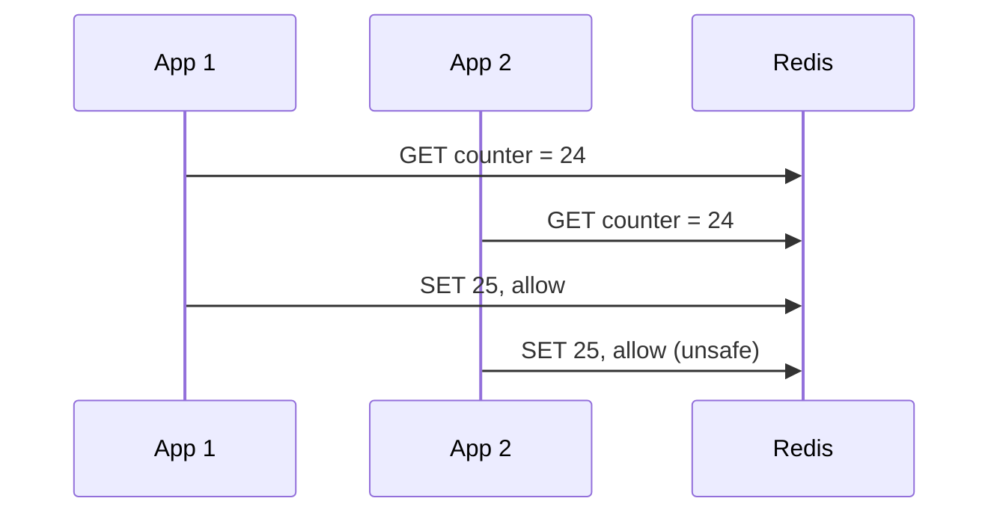

# 03 — Distributed rate limiting

## Mục tiêu

Bảo vệ quota và tài nguyên dùng chung khi request đi qua nhiều app node. Rate limiting theo user không thay xác thực/chống bot: nếu client tự chọn ID, có thể đổi ID để vượt quota.

| Thuật toán | Hành vi | Trade-off |
|---|---|---|
| Token bucket | Capacity B, refill r token/s | Cho burst B; giới hạn dài hạn r, state nhỏ |
| Leaky bucket | Thoát request theo tốc độ cố định | Làm phẳng tải nhưng thêm queue latency, phải giới hạn queue |
| Fixed window | Counter theo khoảng cố định | Đơn giản; burst gần ranh giới có thể vượt mức trên cửa sổ trượt |
| Sliding log | Giữ timestamp từng request | Chính xác theo cửa sổ đã định nghĩa nếu update atomic; RAM theo số request |
| Sliding counter | Current + weighted previous | State nhỏ, chỉ xấp xỉ; sai số phụ thuộc phân bố traffic |

## Token bucket và sliding counter

Token bucket: `tokens = min(B, tokens + elapsed*r)`, cho request nếu token≥1 rồi trừ 1. Lab capacity 25, refill 25/s. Nếu burst chạy 200ms thì có thể có thêm refill; không assert lúc nào cũng đúng 25 thành công.

Sliding counter với period T: `estimate = current + previous * (1 - elapsed/T)`. Giả định traffic cửa sổ trước tương đối đều. Burst tập trung cuối cửa sổ có thể làm estimate lệch; Lua atomic chỉ loại race counter, không biến estimate thành sliding log chính xác.

## Atomicity, time và expiration

Gộp đọc/time/refill/check/update vào Redis Lua để request không xen ngang. Dùng Redis TIME thay clock riêng từng app; expiration dọn key inactive. Script chỉ phù hợp Redis topology đã chọn: lab dùng Redis standalone, không tuyên bố tương thích Redis Cluster nhiều hash slot. Hot quota key vẫn có thể thành bottleneck.

## HTTP và failure policy

429 báo vượt quota; `Retry-After` là hướng dẫn chờ. Lab dùng `X-RateLimit-Limit`/`X-RateLimit-Remaining` như quy ước phổ biến, không gọi các header X- này là chuẩn IETF. Token bucket không có một “reset time” cố định như fixed window.

Lab fail-closed: Redis unavailable → 503, không bỏ qua quota hoặc dùng counter local vì nó tạo guarantee khác. Production có thể chọn local fallback cho availability nhưng phải ghi rõ mức leak chấp nhận. Proxy trust và identity cần cấu hình, không lấy raw header làm danh tính đã xác thực.

## Lab và tự đánh giá

[Lab 03](../labs/module-03-rate-limiter/) có hai API node dùng chung Lua state. `unsafe` cố ý tách GET/SET và delay để tái hiện TOCTOU. Test burst trực tiếp cả hai node, đối chiếu allowed với capacity + refill và quan sát 429/Retry-After.

Bài tập: API cần quota theo tenant và endpoint, có request đắt gấp 10 lần. Thiết kế weighted token cost và global admission control; nêu policy khi Redis latency vượt deadline. Tiêu chí đạt: phân biệt quota với backpressure, burst với sustained rate và exact với approximate window.

Nguồn: [Redis Lua atomic execution](https://redis.io/docs/latest/develop/programmability/eval-intro/), [HTTP 429](https://www.rfc-editor.org/rfc/rfc6585.html#section-4).
