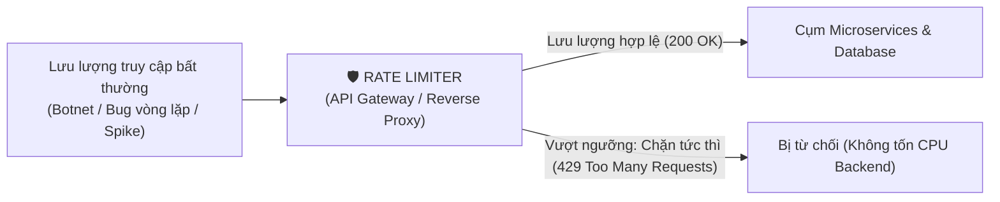
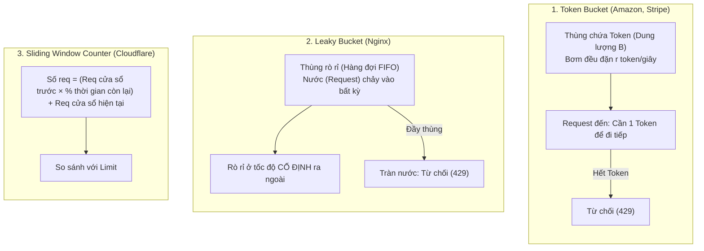
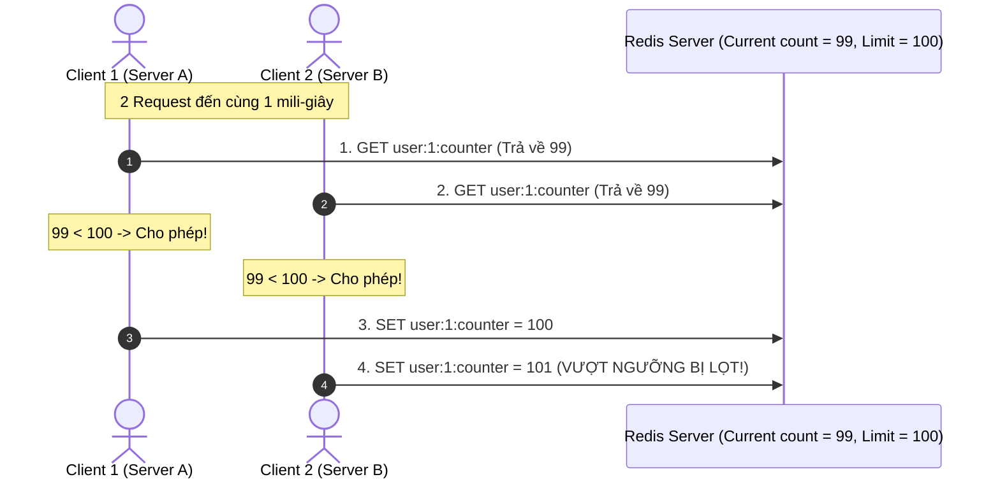

# CHUYÊN ĐỀ 03: GIỚI HẠN TỐC ĐỘ PHÂN TÁN & ĐIỀU TIẾT LƯU LƯỢNG (DISTRIBUTED RATE LIMITING & TRAFFIC SHAPING)

> **Mục tiêu cấp độ Senior / Architect**: Hiểu rõ lý do tại sao Rate Limiting là phòng tuyến số 1 để bảo vệ hệ thống trước DoS/quá tải, so sánh toán học và đánh đổi của 5 thuật toán giới hạn tốc độ phổ biến, giải quyết triệt để lỗi tương tranh dữ liệu (Race Condition) trong môi trường phân tán bằng **Redis Lua Scripting**, và tuân thủ các chuẩn HTTP Headers quốc tế (`429 Too Many Requests`, `Retry-After`).

---

## 1. Tại sao Rate Limiting là Phòng Tuyến Sống Còn?

Trong một hệ thống phân tán quy mô lớn, một dịch vụ không có Rate Limiter giống như một ngân hàng không có bảo vệ ở cửa ra vào:

### 4 Lý do Cốt lõi của Rate Limiting:
1. **Chống cạn kiệt tài nguyên (Resource Starvation / DoS Defense)**: Ngăn chặn một vài người dùng hoặc bot gửi hàng ngàn request mỗi giây làm tắc nghẽn CPU, RAM và Database Connection Pool của những người dùng chân chính khác.
2. **Kiểm soát chi phí (Cost Management)**: Rất nhiều hệ thống phụ thuộc vào các dịch vụ bên thứ 3 tính tiền theo từng request (như OpenAI API, AWS Rekognition, Cổng thanh toán Stripe, SMS OTP Gateway). Nếu không rate-limit, một vòng lặp bug từ client có thể tiêu tốn hàng ngàn USD chỉ trong một đêm.
3. **Chính sách sử dụng công bằng (Fair Usage Policy trong SaaS)**: Trong kiến trúc Đa người thuê (Multi-tenant Architecture), Rate Limiter đảm bảo Tenant A không thể chiếm dụng toàn bộ tài nguyên của Tenant B.
4. **Ngăn chặn sập dây chuyền (Cascading Failure)**: Giúp hệ thống hoạt động ở ngưỡng thông lượng tối ưu (Graceful Throttling) thay vì bị sập hoàn toàn.

---

## 2. So sánh Chuyên sâu 5 Thuật toán Giới hạn Tốc độ

### Bảng phân tích chi tiết & Đánh đổi (Trade-offs)

| Thuật toán | Cơ chế hoạt động | Ưu điểm | Nhược điểm | Trường hợp sử dụng chuẩn |
| :--- | :--- | :--- | :--- | :--- |
| **1. Token Bucket** | Thùng chứa tối đa $B$ tokens. Cứ mỗi giây bổ sung đều đặn $r$ tokens. Mỗi request tiêu thụ 1 token. Hết token thì bị từ chối. | • **Cho phép lưu lượng bùng nổ ngắn (Traffic Burst)**: Nếu thùng đang đầy, hệ thống có thể xử lý ngay $B$ request cùng lúc. • Bộ nhớ cực kỳ nhỏ gọn ($O(1)$). | Khó cấu hình để có được tỷ lệ $r$ và $B$ tối ưu cho các luồng mạng phức tạp. | **AWS API Gateway, Stripe API, GitHub API.** |
| **2. Leaky Bucket** | Request đi vào một hàng đợi FIFO (thùng). Nước rò rỉ ra đáy thùng ở **tốc độ cố định không đổi**. Nếu hàng đợi đầy, request mới bị loại bỏ. | • Làm phẳng lưu lượng truy cập (Traffic Smoothing / Shaping), triệt tiêu hoàn toàn hiện tượng bùng nổ đột ngột. | Request bị trễ (Buffer delay) vì phải xếp hàng; không hỗ trợ traffic burst. | **Nginx (`limit_req`), Điều khiển lưu lượng mạng viễn thông.** |
| **3. Fixed Window Counter** | Chia thời gian thành các cửa sổ cố định (ví dụ: 00:00 - 01:00). Mỗi cửa sổ có một biến đếm tăng dần. | • Cực kỳ đơn giản để code. • Tốn rất ít RAM ($O(1)$). | **Lỗi ranh giới cửa sổ (Boundary Problem)**: Có thể cho phép gấp đôi lượng request ($2 \times \text{Limit}$) ở thời điểm giao thoa giữa 2 cửa sổ! | Các tác vụ đơn giản, không yêu cầu độ chính xác cao. |
| **4. Sliding Window Log** | Lưu dấu thời gian (Unix timestamp) của **tất cả** request trong một Redis Sorted Set (`ZSET`). Xóa các timestamp cũ hơn $T - \text{Window}$ rồi đếm số phần tử còn lại. | • **Độ chính xác tuyệt đối 100%**, loại bỏ hoàn toàn lỗi ranh giới. | **Cực kỳ tốn RAM**: Nếu giới hạn 100,000 req/phút, Redis phải lưu 100,000 bản ghi timestamp cho mỗi user! | Hệ thống bảo mật cao, tài chính, giao dịch nhạy cảm. |
| **5. Sliding Window Counter** | Kết hợp số lượng request của cửa sổ trước (tính theo trọng số thời gian) cộng với số lượng của cửa sổ hiện tại. | • **Bộ nhớ siêu nhỏ ($O(1)$)**: Chỉ lưu 2 số nguyên. • Độ chính xác rất cao (sai số $< 0.05\%$). | Chỉ là ước lượng gần đúng, không chính xác tuyệt đối từng mili-giây như Log. | **Cloudflare, Kong API Gateway, Envoy.** |

---

## 3. Công thức Toán học của Sliding Window Counter (Chuẩn Cloudflare)

Giả sử cửa sổ là **1 phút**, giới hạn là **100 requests/phút**.
* Cửa sổ trước (phút thứ 00:00): có **80 requests**.
* Cửa sổ hiện tại (phút thứ 01:00): đang trôi qua được **30% (tức là giây thứ 18)** và đã ghi nhận **30 requests**.

Số lượng request ước tính tại thời điểm giây thứ 18:
$$\text{Requests Hiện Tại} = \left(\text{Requests Cửa Sổ Trước} \times (1 - 0.3)\right) + \text{Requests Cửa Sổ Hiện Tại}$$
$$\text{Requests Hiện Tại} = (80 \times 0.7) + 30 = 56 + 30 = \mathbf{86\ requests}$$

Vì $86 \le 100$, request được **CHẤP NHẬN**. Nếu giá trị này $> 100$, request lập tức bị từ chối với mã lỗi `429`.

---

## 4. Cạm Bẫy Race Condition Trong Môi Trường Phân Tán

Khi hệ thống chạy trên cụm nhiều server (Cluster Mode) với Shared Redis:

### Lỗi Time-Of-Check to Time-Of-Use (TOCTOU):
Hai tiến trình cùng đọc giá trị 99, cùng kết luận là chưa vượt ngưỡng 100, và cùng cho request đi qua. Hậu quả là **hệ thống bị lọt tải (Traffic Leakage)**.

### ✅ Giải pháp Architect: Atomic Execution với Redis Lua Script
Redis là một cỗ máy **Single-Threaded Event Loop**. Mọi script viết bằng **Lua** khi gửi vào Redis sẽ được thực thi **nguyên tử (Atomically)**: không có bất kỳ lệnh nào khác được xen ngang giữa quá trình đọc và ghi!

---

## 5. Chuẩn HTTP Headers cho Rate Limiting (IETF Standard)

Khi trả về phản hồi cho client, một API chuyên nghiệp phải luôn cung cấp các headers tiêu chuẩn:

| HTTP Header | Ý nghĩa | Ví dụ |
| :--- | :--- | :--- |
| `X-RateLimit-Limit` | Số request tối đa được phép trong 1 chu kỳ | `100` |
| `X-RateLimit-Remaining` | Số request còn lại được phép gọi trong chu kỳ hiện tại | `14` |
| `X-RateLimit-Reset` | Thời điểm cửa sổ sẽ được reset (Unix timestamp tính bằng giây) | `1727827200` |
| `Retry-After` *(Khi bị 429)* | Số giây client phải chờ trước khi được gửi request tiếp theo | `5` |

### Mã phản hồi chuẩn:
* **HTTP 429 Too Many Requests**: Kèm payload thông báo rõ lý do và thời gian chờ.
