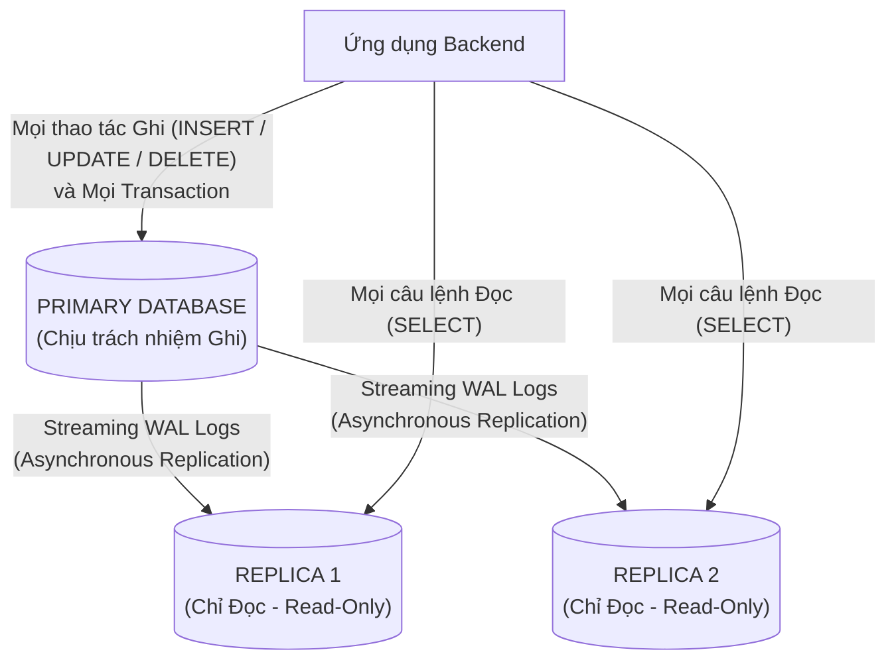
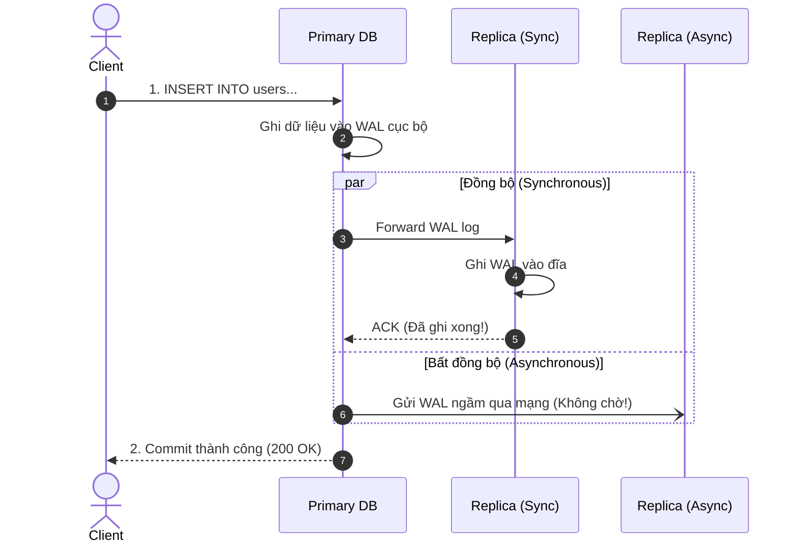
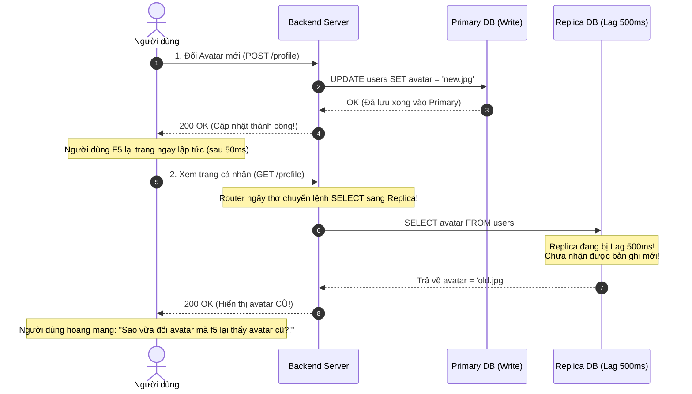

# CHUYÊN ĐỀ 04: SAO CHÉP DỮ LIỆU, PHÂN TÁCH ĐỌC/GHI & XỬ LÝ REPLICATION LAG

> **Mục tiêu cấp độ Senior / Architect**: Làm chủ kiến trúc Database Primary-Replica (Master-Slave), phân tích đánh đổi sống còn giữa Đồng bộ (Synchronous) và Bất đồng bộ (Asynchronous), hiểu bản chất của hiện tượng **Replication Lag**, và thiết kế giải pháp đạt chuẩn **Read-Your-Own-Writes Consistency** và **Monotonic Reads** ở tầng ứng dụng (Application-Level Smart Database Router).

---

## 1. Tại sao Cần Sao chép Dữ liệu (Database Replication)?

Trong các hệ thống thực tế (mạng xã hội, thương mại điện tử, tin tức), lưu lượng truy cập có đặc tính bất đối xứng:
$$\text{Tỷ lệ Đọc / Ghi (Read-to-Write Ratio)} \approx 10:1 \quad \text{đến} \quad 100:1$$
Cứ 100 lượt người dùng lướt xem bài viết, chỉ có 1 lượt đăng bài mới hoặc bình luận.

Nếu chỉ dùng 1 máy chủ Database duy nhất (Single Instance), CPU và Disk I/O của máy đó sẽ nhanh chóng bị nghẽn bởi hàng ngàn câu lệnh `SELECT`. Hơn nữa, nếu máy chủ này bị sập phần cứng, toàn bộ hệ thống sẽ tê liệt (**Single Point of Failure - SPOF**).

### 3 Lợi ích Lớn của Database Replication:
1. **Tăng quy mô đọc (Read Scalability)**: Thêm các Replicas (máy chủ bản sao) để chia sẻ tải đọc. Khi lượng đọc tăng gấp 5 lần, ta chỉ cần bật thêm 5 Replica nodes.
2. **Độ sẵn sàng cao & Khắc phục sự cố (High Availability & Failover)**: Nếu Primary bị sập, một Replica có dữ liệu mới nhất sẽ được thăng cấp (Promote) lên làm Primary mới.
3. **Giảm độ trễ địa lý (Geographic Read Latency)**: Đặt Replica ở các trung tâm dữ liệu gần người dùng (ví dụ: Primary ở US, Replica ở Singapore phục vụ user Đông Nam Á).

---

## 2. Đồng bộ (Synchronous) vs. Bất đồng bộ (Asynchronous) Replication

### So sánh Chuyên sâu & Phân tích Đánh đổi

| Tiêu chí | Đồng bộ (Synchronous) | Bất đồng bộ (Asynchronous) | Bán đồng bộ (Semi-Synchronous) |
| :--- | :--- | :--- | :--- |
| **Cơ chế** | Primary chỉ báo thành công cho Client khi **toàn bộ** Replicas đã ghi xong. | Primary ghi xong đĩa cục bộ là báo thành công ngay. WAL được gửi ngầm sau. | Primary chỉ cần chờ **đúng 1 Replica** xác nhận đã nhận WAL là báo thành công. |
| **Độ trễ Ghi (Write Latency)** | **Rất cao**: Bị kéo dài bằng độ trễ của Replica chậm nhất (Straggler problem). | **Cực nhanh**: Chỉ tốn thời gian ghi đĩa cục bộ của Primary. | **Vừa phải**: Chỉ phụ thuộc vào Replica nhanh nhất trong mạng nội bộ. |
| **Rủi ro mất dữ liệu (RPO)** | **RPO = 0 (Zero Data Loss)**: Dữ liệu luôn tồn tại trên ít nhất 2 máy. | **RPO > 0**: Nếu Primary sập trước khi kịp sync, dữ liệu chưa gửi sẽ bị mất vĩnh viễn! | **RPO $\approx$ 0**: Dữ liệu đã an toàn trên ít nhất 2 node. |
| **Độ sẵn sàng khi ghi (Availability)** | **Kém**: Nếu 1 Replica bị treo hoặc đứt cáp mạng, Primary **bị block hoàn toàn không thể ghi**! | **Rất cao**: Replicas chết không ảnh hưởng đến khả năng ghi của Primary. | **Cao**: Chỉ cần còn ít nhất 1 Replica sống là ghi bình thường. |

> [!IMPORTANT]
> **Thực tế trong Production**: 95% các hệ thống lớn (Facebook, MySQL Replication, PostgreSQL Streaming Replication) sử dụng **Asynchronous** hoặc **Semi-Synchronous** vì không thể đánh đổi hiệu năng ghi và độ sẵn sàng của Primary để chờ đợi mạng phân tán.

---

## 3. Thảm họa "Replication Lag" & 2 Sự Cố Kinh Điển

Vì hầu hết replication là bất đồng bộ (Asynchronous), luôn tồn tại một khoảng trễ thời gian gọi là **Replication Lag**:
$$\text{Replication Lag} = T_{\text{Replica Commit}} - T_{\text{Primary Commit}}$$

Replication Lag bình thường chỉ khoảng $5 - 50\text{ ms}$, nhưng khi mạng chập chờn hoặc Replica đang bận chạy một câu query báo cáo nặng, lag có thể tăng lên **vài giây đến vài phút**!

---

### Sự cố 1: Vi phạm "Read-Your-Own-Writes Consistency"
* **Bản chất**: Người dùng vừa ghi dữ liệu thành công, nhưng khi đọc lại ngay lập tức thì không thấy dữ liệu mình vừa tạo/sửa.
* **Ví dụ thực tế**:
  * Đổi mật khẩu thành công $\rightarrow$ Hệ thống bắt đăng nhập lại $\rightarrow$ Nhập mật khẩu mới bị báo lỗi "Sai mật khẩu" (vì bảng auth đọc từ Replica đang bị lag)!
  * Đăng bài viết mới $\rightarrow$ Bấm nút Đăng $\rightarrow$ Màn hình refresh không thấy bài viết đâu.
* **Giải pháp Kiến trúc**:
  1. **Time-based Pinning (Ghim tạm thời vào Primary)**:
     * Khi người dùng thực hiện một thao tác Ghi (`POST/PUT/DELETE`), lưu một cờ vào Session/Redis: `user:123:last_write = timestamp`.
     * Trong vòng $N$ giây tiếp theo (ví dụ: 3 giây), **mọi request đọc của riêng user đó bắt buộc phải định tuyến vào Primary**!
     * Sau 3 giây (khi replication lag chắc chắn đã kết thúc), chuyển hướng đọc của user trở lại Replicas bình thường.
  2. **LSN (Log Sequence Number) Tracking**:
     * Primary trả về mã số phiên bản commit (LSN). Khi đọc, Client gửi kèm LSN này. Nếu Replica chưa đồng bộ tới LSN đó, Router chuyển hướng sang Primary hoặc chờ Replica đồng bộ kịp.

---

### Sự cố 2: Vi phạm "Monotonic Reads" (Nhảy lùi thời gian)
* **Bản chất**: Người dùng tải trang lần 1 đọc trúng Replica A (lag 5ms, thấy tin nhắn mới). Người dùng tải trang lần 2 đọc trúng Replica B (đang bị lag 800ms) $\rightarrow$ Tin nhắn mới vừa thấy bỗng nhiên biến mất!
* **Giải pháp**: **User-to-Replica Sticky Routing** (Sử dụng Consistent Hashing theo `user_id` để một người dùng luôn luôn đọc từ cùng một Replica duy nhất, đảm bảo thời gian chỉ đi tiến chứ không bao giờ nhảy lùi).

---

## 4. Nguyên tắc Vàng khi Phân tách Đọc/Ghi (Read/Write Splitting)

Khi viết tầng Router điều phối Database:

1. **Phân loại theo động từ SQL**:
   * `SELECT`: Định tuyến sang Replica Pool (dùng thuật toán Round-Robin hoặc Least Connections).
   * `INSERT`, `UPDATE`, `DELETE`: Luôn luôn vào Primary Pool.
2. **Quy tắc Transaction (BẮT BUỘC)**:
   * Bất kỳ khối lệnh nào nằm trong Transaction (`BEGIN TRANSACTION ... COMMIT`): **Dù bên trong chỉ có câu lệnh `SELECT`, TOÀN BỘ TRANSACTION BẮT BUỘC PHẢI CHẠY TRÊN PRIMARY**!
   * *Lý do*: Đọc dữ liệu trong Replica rồi ghi xuống Primary trong cùng 1 transaction logic sẽ gây ra hiện tượng lệch pha dữ liệu (Read Skew) và phá vỡ tính cô lập (ACID Isolation Level).
