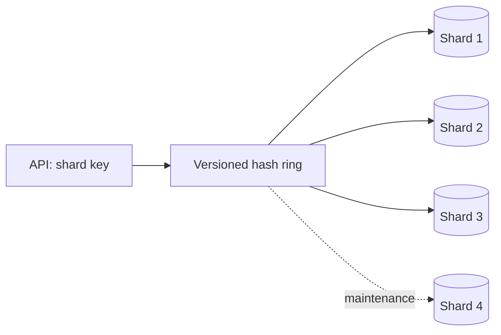

# 05 — Sharding, consistent hashing và distributed ID

## Mục tiêu

Chọn shard key dựa trên access pattern và chứng minh dữ liệu vẫn tìm được sau reshard. Phân biệt partition trong một database với shard trên nhiều database; shard giảm giới hạn một máy nhưng làm transaction, join và vận hành khó hơn.

## Chọn key và routing

Range partition dễ query khoảng nhưng có hot range; hash phân bố đều hơn nhưng scatter-gather cho range query. Tenant ID giữ dữ liệu tenant cùng shard nhưng tenant lớn có thể gây skew. Random user ID giảm skew, song không giúp query mọi user theo email khi không có secondary index phân tán.

Modulo `hash(key)%N` đơn giản nhưng đổi N làm nhiều key đổi owner. Consistent hashing đặt virtual node trên vòng hash, key đi tới vnode kế tiếp; thêm node làm phần key chuyển sang node mới. Tỷ lệ trung bình quanh 1/(N+1) cần hash/phân bố đủ đều; không cam kết đúng 25% cho mọi tập key.

Lookup trên ring đã sort dùng binary search O(log V), với V tổng virtual nodes. Việc xây/sort ring có chi phí riêng; không gọi toàn pipeline là O(1). Scatter-gather query nhiều shard tăng network/CPU và phải xử lý partial failure; lab trả lỗi nếu không lấy đủ shard, không tự trả dữ liệu thiếu.

## Reshard là di chuyển dữ liệu

Thêm node vào ring **không tự di chuyển bản ghi**. Lab dùng coordinator lưu nodes/version/state; API giữ shared advisory lock cho thao tác đọc/ghi. CLI reshard lấy exclusive lock, bật maintenance, copy bản ghi tới owner mới, kiểm tra payload, đổi routing version rồi dọn bản sao dư. Shard4 được bật riêng bằng Compose profile.

Copy lỗi trước switch: nguồn cũ giữ nguyên, state MAINTENANCE, sửa lỗi rồi chạy lại. Cleanup lỗi sau switch: nguồn mới đã có dữ liệu được verify, chạy lại cleanup. Không tự cho ghi tiếp trước khi copy verified. Đây là offline migration: client có thể gặp 503/timeout; production online reshard cần copy snapshot, theo dõi change log/dual-write và cutover protocol.

Coordinator và shard không có distributed transaction. Insert vào shard thành công rồi client timeout có thể để kết quả chưa biết; lab create-user chưa có idempotency key. Không dùng thiết kế này để suy ra exactly-once create.

## Snowflake và ID

Snowflake lab dùng timestamp milliseconds, worker ID 10 bit, sequence 12 bit, epoch 2024-01-01. JS trả chuỗi BigInt để không mất precision. Worker ID duy nhất giữa node là tiền đề; cùng worker ID và thời điểm/sequence có thể tạo collision. Clock lùi hoặc sequence vượt 4.095 trong một millisecond trả 503 để caller retry, không silently sinh ID trùng.

UUIDv4 đơn giản, random và không cần worker registry; UUIDv7/Snowflake time-sortable có thể tốt hơn cho locality. Random insert có thể làm B-tree page split/cache locality kém, nhưng không có tỷ lệ chậm 5–10 lần cố định; cần benchmark index/workload thực.

## Lab và tự đánh giá

[Lab 05](../labs/module-05-db-sharding/) dùng ba PostgreSQL shard thật, coordinator và hai app node. Tạo 100 user, bật shard4 và chạy reshard; đọc lại từng ID và scatter-gather đủ 100. Unit test kiểm tra key đổi owner chỉ sang node mới và Snowflake không trùng giữa hai worker, từ chối clock lùi.

Bài tập: tenant chiếm 40% traffic, nhưng hầu hết query join trong tenant. Chọn key và cách tách tenant lớn; phân tích phí lookup directory so với hash routing. Tiêu chí đạt: có migration/data movement plan và không nhầm ID unique với transaction consistency.

Nguồn: [Dynamo paper](https://www.allthingsdistributed.com/files/amazon-dynamo-sosp2007.pdf), [PostgreSQL partitioning](https://www.postgresql.org/docs/16/ddl-partitioning.html), [UUID RFC 9562](https://www.rfc-editor.org/rfc/rfc9562.html).
