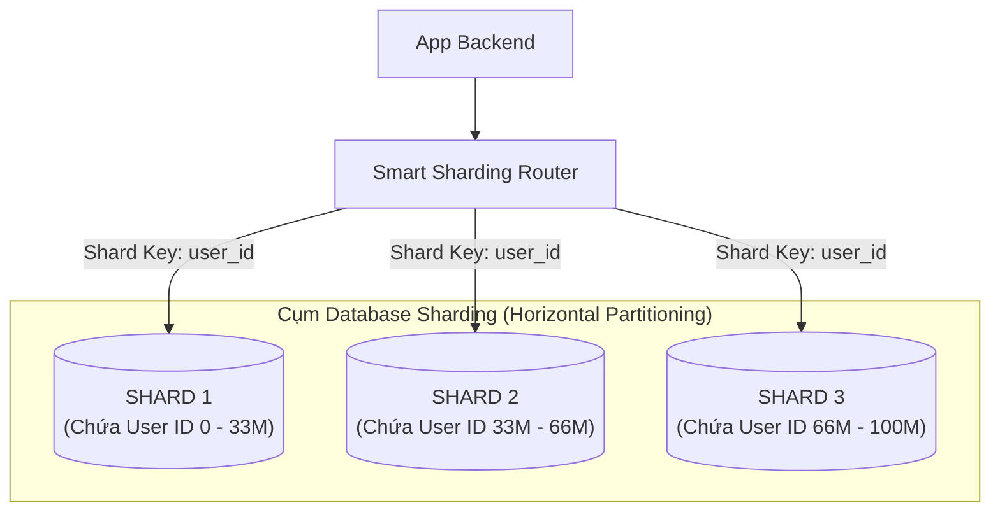
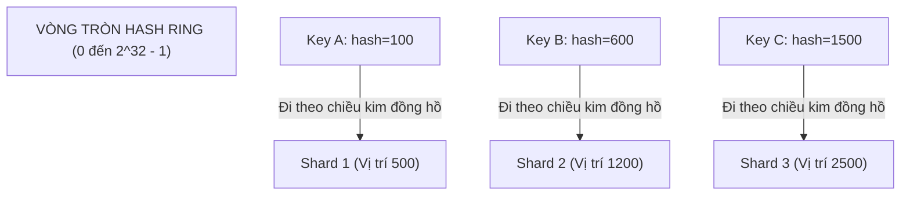

# CHUYÊN ĐỀ 05: PHÂN MẢNH DATABASE, VÒNG BĂM NHẤT QUÁN & KHÓA CHÍNH PHÂN TÁN (SHARDING, CONSISTENT HASHING & SNOWFLAKE ID)

> **Mục tiêu cấp độ Senior / Architect**: Hiểu rõ khi nào buộc phải Sharding Database, phân biệt Vertical vs. Horizontal Sharding, làm chủ thuật toán **Consistent Hashing với Virtual Nodes** để giải quyết bài toán di chuyển dữ liệu khi mở rộng/thu hẹp cụm, và thiết kế bộ sinh mã định danh phân tán **Twitter Snowflake ID (64-bit BigInt)** tối ưu cho B-Tree index.

---

## 1. Khi nào Hệ thống Buộc phải Sharding?

Ở Module 04, ta đã dùng Replicas để chia sẻ tải Đọc (Read Scalability). Nhưng khi hệ thống đạt quy mô siêu lớn:
1. **Trần dung lượng đĩa (Storage Ceiling)**: Bảng dữ liệu (ví dụ: `orders`, `messages`) vượt quá $5\text{ TB} - 50\text{ TB}$. Một máy chủ vật lý hay EBS volume không thể chứa nổi hoặc chi phí đĩa đơn lẻ tăng đột biến.
2. **Trần hiệu năng Ghi (Write Bottleneck)**: Tỷ lệ ghi vượt quá $20,000 - 50,000\text{ writes/s}$. Vì mọi lệnh ghi bắt buộc phải đổ vào 1 Primary DB duy nhất, Primary sẽ bị cạn kiệt IOPS và nghẽn khóa hàng (Row-level Locks).
3. **Kích thước Index quá lớn (Index RAM Depletion)**: B-Tree index của bảng vượt quá dung lượng RAM của máy chủ, khiến mọi thao tác đọc/ghi đều phải swap đĩa liên tục.



---

## 2. Các Chiến Lược Phân Mảnh (Sharding Strategies)

### 2.1. Range-Based Sharding (Theo khoảng giá trị)
* **Nguyên lý**: Chia theo dải giá trị (ví dụ: User ID 1 - 10M vào Shard 1; 10M - 20M vào Shard 2; hoặc chia theo tháng: 01/2026 vào Shard 1).
* **Ưu điểm**: Dễ dàng thực hiện truy vấn khoảng (`SELECT WHERE created_at BETWEEN ...`).
* **Nhược điểm chết người**: **Hotspot Problem**! Các bản ghi mới tạo luôn đổ dồn vào Shard chứa dải ID mới nhất, khiến Shard đó bị quá tải trong khi các Shard cũ nhàn rỗi.

### 2.2. Hash-Based Sharding truyền thống (`hash(key) % N`)
* **Nguyên lý**: Tính giá trị băm của Shard Key modulo cho số lượng Shards $N$:
  $$\text{Shard Index} = \text{hash}(\text{user\_id}) \pmod N$$
* **Ưu điểm**: Dữ liệu được phân bổ đồng đều tuyệt đối (Uniform Distribution), không bị Hotspot.
* **Thảm họa Re-sharding**:
  * Giả sử đang có $N = 3$ Shards. Hệ thống quá tải, ta bổ sung thêm 1 Shard thành $N = 4$.
  * Phép tính modulo thay đổi từ $\pmod 3$ sang $\pmod 4$.
  * **Hậu quả**: Hơn **$75\%$ số lượng bản ghi** bị thay đổi vị trí Shard! Toàn bộ hệ thống phải dừng hoạt động (Downtime) để di chuyển hàng chục Terabytes dữ liệu qua mạng!

---

## 3. Cứu Cánh Kiến Trúc: Consistent Hashing (Vòng Băm Nhất Quán)

Thuật toán Consistent Hashing (phát minh bởi Karger et al. tại MIT) giải quyết triệt để thảm họa Re-sharding.

### 3.1. Nguyên lý Vòng băm (Hash Ring)
* Thay vì modulo cho $N$, ta ánh xạ cả **Nodes (Máy chủ)** và **Keys (Dữ liệu)** lên cùng một vòng tròn băm $0$ đến $2^{32} - 1$ (sử dụng thuật toán băm như MD5 hoặc MurmurHash).
* Để tìm Shard cho một Key: Ta băm Key ra một vị trí trên vòng tròn, sau đó **đi theo chiều kim đồng hồ** cho đến khi gặp máy chủ đầu tiên. Máy chủ đó sẽ chịu trách nhiệm lưu trữ Key đó.



### 3.2. Khi Bổ sung hoặc Giảm bớt Node:
* Khi thêm Shard 4 vào giữa Shard 2 và Shard 3:
  * **Chỉ các keys nằm giữa Shard 2 và Shard 4 mới cần di chuyển sang Shard 4**.
  * Tất cả các keys thuộc Shard 1 và Shard 2 hoàn toàn giữ nguyên vị trí!
* **Định lý Karger**: Khi thêm/bớt 1 máy chủ trong cụm $N$ máy, chỉ có trung bình **$\frac{1}{N}$ số lượng keys** phải di chuyển (thay vì $75\% - 90\%$ như modulo thông thường)!

### 3.3. Virtual Nodes (Nút ảo) - Giải quyết Lệch Tải
Nếu chỉ đặt 3 điểm node vật lý trên vòng tròn, khoảng cách giữa chúng có thể không đều, dẫn đến một node gánh $60\%$ dữ liệu.
* **Giải pháp**: Mỗi node vật lý được ánh xạ thành $V$ nút ảo (ví dụ $V = 100 - 300$ vnodes: `Shard1#1`, `Shard1#2`, ..., `Shard1#100`) nằm rải đều khắp vòng tròn.
* Dữ liệu được phân bổ cân bằng hoàn hảo trên toàn cụm.

---

## 4. Khóa Chính Phân Tán: Twitter Snowflake ID (64-bit Integer)

Trong cơ sở dữ liệu Sharded, cơ chế `AUTO_INCREMENT` của MySQL/Postgres bị phá vỡ hoàn toàn vì các Shards hoạt động độc lập và sẽ sinh trùng ID với nhau.

### Tại sao không dùng UUIDv4?
* UUIDv4 có độ dài 128 bits (36 ký tự chuỗi), tốn gấp đôi bộ nhớ.
* **Nhược điểm trí mạng**: UUIDv4 hoàn toàn ngẫu nhiên (Unordered). Khi chèn vào B-Tree index của Database, nó gây ra hiện tượng **Page Splitting** và phân mảnh đĩa nghiêm trọng, làm giảm tốc độ chèn dữ liệu tới **$5 - 10$ lần**!

### Cấu trúc 64-bit của Twitter Snowflake ID:

```
+--------------------------------------------------------------------------+
| 1 bit |      41 bits        |    5 bits   |    5 bits   |    12 bits     |
| Unused|     Timestamp       | DatacenterId|   WorkerId  |Sequence Number |
+--------------------------------------------------------------------------+
```

1. **1 bit đầu tiên (Dấu)**: Luôn là `0` để đảm bảo ID luôn là số nguyên dương.
2. **41 bits Timestamp**: Số mili-giây trôi qua tính từ một mốc thời gian tùy chỉnh (Custom Epoch).
   * $2^{41} \text{ ms} \approx 69\text{ năm}$ hoạt động của hệ thống!
3. **5 bits Datacenter ID + 5 bits Worker ID**: Hỗ trợ tối đa $2^{10} = \mathbf{1024\ máy\ chủ}$ sinh ID độc lập cùng lúc trong hệ thống.
4. **12 bits Sequence Number**: Bộ đếm tự tăng trong cùng 1 mili-giây trên 1 máy chủ ($2^{12} = \mathbf{4096\ IDs / ms}$).

$$\text{Công suất sinh ID} = 1024 \text{ workers} \times 4,096 \text{ IDs} \times 1,000 \text{ ms} \approx \mathbf{4.19\ tỷ\ IDs / giây!}$$

### Ưu điểm vượt trội:
* **Time-Sortable (Tự nhiên có thứ tự thời gian)**: B-Tree index chèn dữ liệu tuần tự vào cuối trang đĩa (Append-only style), tốc độ chèn cực nhanh!
* **Độc lập phân tán (Decentralized)**: Không cần gọi mạng tới Redis hay DB trung tâm để lấy ID tiếp theo; từng microservice tự sinh ID ở bộ nhớ cục bộ mà không bao giờ bị trùng.
