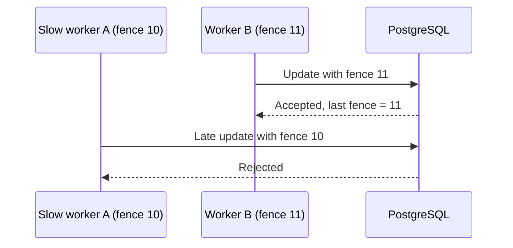

# 06 — CAP/PACELC, lease và fencing

## Mục tiêu

Hiểu guarantee dưới network partition và biết tại sao lock hết hạn không ngăn worker cũ tiếp tục chạy. Dùng database constraints/transaction cho tính đúng đắn nghiệp vụ trước khi thêm distributed lock.

## CAP và PACELC

CAP: trong mô hình hệ thống có network partition, không thể đồng thời bảo đảm linearizability và availability cho mọi request ở node không lỗi. Availability theo định lý không đồng nghĩa HTTP endpoint trả một mã lỗi nhanh; consistency ở đây không phải chữ C trong ACID.

“Khi có partition, chọn C hay A” hữu ích hơn “luôn chọn 2 trong 3”. Network partition là failure model phải xử lý; khi mạng bình thường hệ thống có thể đáp ứng cả C và A theo mô hình đã chọn. Phân loại database chỉ theo tên CP/AP dễ gây hiểu sai vì read/write mode, quorum và topology thay đổi guarantee.

PACELC bổ sung trade-off latency/consistency khi không có partition: khi partition cân nhắc availability/consistency; nếu không, cân nhắc latency/consistency. Nó không thay thế phân tích operation cụ thể, timeout, clock và failure assumptions.

## Lease, ownership và release

Mutex RAM chỉ bảo vệ một tiến trình. Redis `SET key token NX PX ttl` cung cấp lease có thời hạn trong instance đó. TTL giúp tránh khóa vĩnh viễn khi owner chết, nhưng worker GC pause lâu hơn TTL vẫn có thể tỉnh dậy và viết.

Release phải atomically kiểm tra token trước DEL, nếu không owner cũ xóa lease của owner mới:

```lua
if redis.call('GET', KEYS[1]) == ARGV[1] then
  return redis.call('DEL', KEYS[1])
end
return 0
```

Redis replication async có thể làm mất lock khi failover; một Redis instance không chứng minh mutual exclusion qua mọi fault. Không dùng lock như thay thế constraint duy nhất hoặc atomic stock decrement.

## Fencing ở tài nguyên đích



Token tăng đơn điệu phải đến từ nguồn có guarantee phù hợp và tồn tại sau restart. Lab cấp sequence PostgreSQL trước acquire; token thất bại có thể để gap, điều đó không ảnh hưởng uniqueness. DB chỉ cho write khi fence mới lớn hơn fence đã lưu. Nếu attempt chậm lấy lease sau attempt có token mới hơn đã ghi, write sẽ bị từ chối — ưu tiên safety, caller phải thử acquire lại.

Fencing ngăn old write **sau khi token mới đã được áp dụng**. Nó không bảo đảm old worker chưa từng viết trong khoảng giữa lease expiry và new write. Kiểm tra Redis rồi ghi DB vẫn có TOCTOU. Vì vậy lab còn dùng conditional update/stock CHECK, và mỗi lease chỉ thực hiện một decrement.

## Redlock và lựa chọn khác

Redlock lấy lease trên đa số Redis master độc lập, trừ thời gian acquire và drift allowance khỏi validity; cần release các lease đã lấy nếu không đủ quorum. Safety phụ thuộc giả định thời gian/độ trễ và cách bảo vệ tài nguyên đích; không tự cấp fencing token đơn điệu. Lab không triển khai cụm Redlock hoặc chứng minh protocol này.

Với transaction cục bộ, dùng row lock/conditional update thường đơn giản hơn. Coordination qua consensus store có thể phù hợp hơn khi cần lease/linearizable metadata, nhưng phải xem API và failure modes cụ thể.

## Lab và tự đánh giá

[Lab 06](../labs/module-06-distributed-lock/) dùng Redis thật và PostgreSQL. Lease 500ms, chờ hết hạn, lấy lease mới; release token cũ không xóa mới, fence cũ bị DB từ chối. API `unsafe` chỉ minh họa lost update và được gắn nhãn rõ.

Bài tập: worker ghi object storage không hỗ trợ fencing compare; Redis lock có đủ an toàn không? Thiết kế versioned object/manifest hoặc đường ghi có transaction. Tiêu chí đạt: phân biệt ownership token và fencing token, nêu giới hạn của cả hai.

Nguồn: [Redis distributed locks và fencing](https://redis.io/docs/latest/develop/clients/patterns/distributed-locks/), [Brewer về CAP](https://www.cs.princeton.edu/courses/archive/spring11/cos448/web/docs/week4_reading2.pdf).
