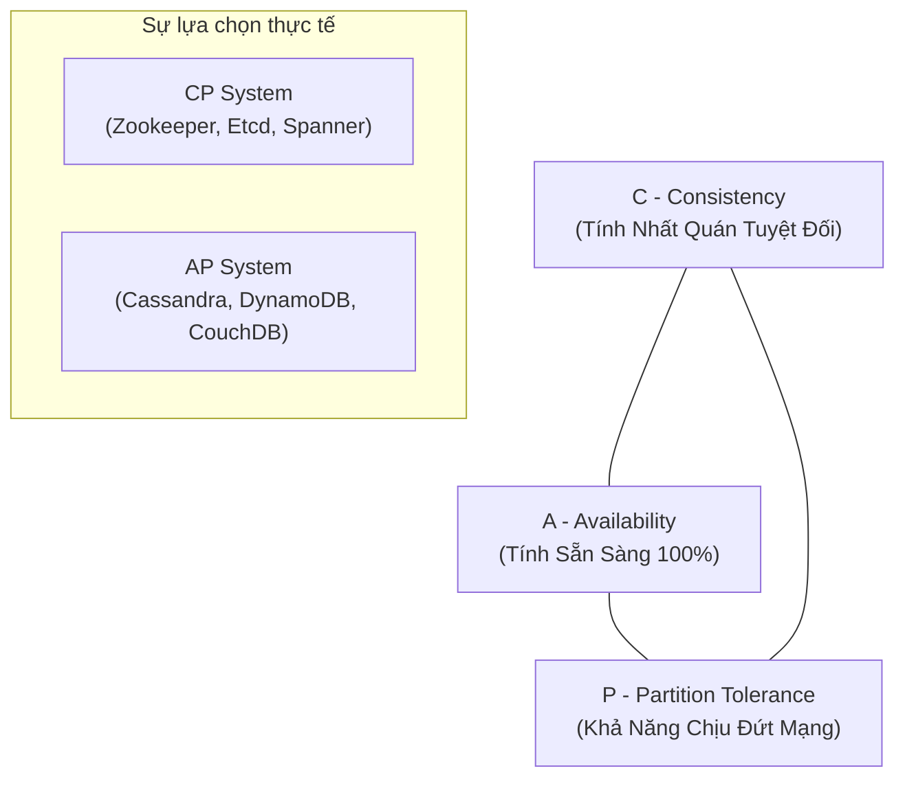
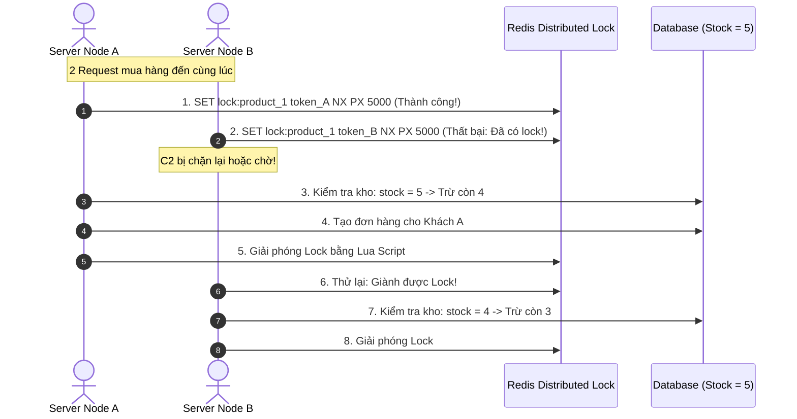

# CHUYÊN ĐỀ 06: ĐỊNH LÝ CAP, PACELC & KHÓA PHÂN TÁN (DISTRIBUTED LOCKS & REDLOCK)

> **Mục tiêu cấp độ Senior / Architect**: Làm chủ hai định lý nền tảng của hệ thống phân tán: **Định lý CAP** và **Định lý PACELC**, hiểu rõ tại sao không có hệ thống "CA" trong thế giới thực, giải quyết thảm họa **Bán âm hàng tồn kho (Overselling / Double Spending)** bằng **Distributed Lock**, và nắm vững các kỹ thuật phòng thủ: **TTL Lease**, **Lua Script Release**, và **Fencing Tokens**.

---

## 1. Định Lý CAP (Brewer's CAP Theorem)

Được đề xuất bởi Eric Brewer vào năm 2000, định lý CAP khẳng định: Trong bất kỳ hệ thống phân tán nào, bạn chỉ có thể chọn tối đa **2 trong 3** thuộc tính:



### Chi tiết 3 Thuộc tính:
1. **Consistency (Tính nhất quán - Linearizability)**: Mọi thao tác đọc đều phải nhận được giá trị của lần ghi mới nhất trên bất kỳ node nào trong hệ thống, hoặc trả về lỗi nếu chưa chắc chắn.
2. **Availability (Tính sẵn sàng)**: Mọi node còn sống đều phải trả lời thành công cho mọi request (không được trả về lỗi timeout hay 500), dù dữ liệu có thể bị cũ.
3. **Partition Tolerance (Khả năng chịu đứt mạng)**: Hệ thống vẫn tiếp tục vận hành dù mạng giữa các máy chủ bị đứt cáp, trễ hoặc mất gói tin.

### ❓ Tại sao trong thực tế KHÔNG BAO GIỜ có hệ thống "CA"?
Trong mạng vật lý (Internet, cáp quang, AWS VPC), **sự cố đứt kết nối mạng (Network Partition) là điều chắc chắn sẽ xảy ra** theo Định luật Murphy.
Khi mạng bị đứt đôi làm 2 nửa máy chủ không thể liên lạc với nhau:
* **Nếu bạn chọn CP**: Để đảm bảo $C$, node bị cô lập buộc phải từ chối phục vụ hoặc trả về lỗi $\rightarrow$ Mất tính sẵn sàng ($A$).
* **Nếu bạn chọn AP**: Để đảm bảo $A$, node bị cô lập vẫn nhận lệnh ghi của người dùng $\rightarrow$ Dữ liệu giữa 2 nửa bị sai lệch, mất tính nhất quán ($C$).

$$\text{Quy tắc Senior: } \mathbf{P} \text{ là bắt buộc. Hệ thống phân tán CHỈ CÓ THỂ là } \mathbf{CP} \text{ hoặc } \mathbf{AP}!$$

---

## 2. Định Lý PACELC (Bản Nâng Cấp Hoàn Hảo của CAP)

Được phát minh bởi Giáo sư Daniel Abadi (Đại học Yale) vào năm 2012 để khắc phục lỗ hổng của CAP:
* *CAP chỉ nói về việc bạn làm gì KHI MẠNG BỊ ĐỨT ($P$). Nhưng trong $99.99\%$ thời gian mạng BÌNH THƯỜNG, hệ thống phải đánh đổi điều gì?*

```
                 +-------------------------------------------------------+
                 |                     ĐỊNH LÝ PACELC                     |
                 +-------------------------------------------------------+
                 |   KHI CÓ SỰ CỐ MẠNG (If Partition - P):                |
                 |       -> Bạn chọn giữa AVAILABILITY (A) hay           |
                 |          CONSISTENCY (C)?                             |
                 |                                                       |
                 |   KHI MẠNG BÌNH THƯỜNG (ELSE - E):                    |
                 |       -> Bạn chọn giữa LATENCY (L) hay                |
                 |          CONSISTENCY (C)?                             |
                 +-------------------------------------------------------+
```

### Bảng phân loại PACELC các Database hàng đầu thế giới:

| Database | Phân loại PACELC | Giải thích Kiến trúc |
| :--- | :---: | :--- |
| **Amazon DynamoDB / Cassandra** | **PA / EL** | • Khi đứt mạng: Chọn Sẵn sàng ($A$).<br>• Khi bình thường: Chọn Độ trễ cực thấp ($L$) bằng cách cho phép ghi/đọc cục bộ với Eventual Consistency. |
| **Google Spanner / CockroachDB** | **PC / EC** | • Khi đứt mạng: Chọn Nhất quán ($C$).<br>• Khi bình thường: Chấp nhận độ trễ mạng cao hơn ($C$) để đồng thuận qua Paxos/Raft. |
| **MongoDB** | **PC / EC (hoặc EL)** | Mặc định ghi Primary đọc Primary (PC/EC). Nếu bật đọc từ Secondary sẽ chuyển thành PC/EL. |

---

## 3. Khóa Phân Tán (Distributed Locks) & Sự Cố Overselling

Khi hệ thống mở rộng ra 10 máy chủ Node.js chạy song song:
* Khóa Mutex trong RAM (như Singleflight ở Module 02) chỉ bảo vệ được bên trong **1 tiến trình duy nhất**.
* Nếu 50 khách hàng cùng bấm nút "Mua ngay" cho một món hàng **chỉ còn 5 chiếc trong kho**:
  * Các máy chủ cùng lúc đọc Database: `stock = 5`.
  * Cả 50 máy chủ cùng kết luận `5 > 0` và cùng thực hiện trừ kho:
    $$\text{Stock Mới} = 5 - 1 = 4$$
  * Hậu quả: **50 đơn hàng được tạo thành công trong khi chỉ có 5 món hàng**! Kho hàng bị bán âm nghiêm trọng (**Overselling / Double Spending**).



---

## 4. Ba Cạm Bẫy Sống Còn khi Cài đặt Distributed Lock

Rất nhiều kỹ sư cài đặt Distributed Lock bị lỗi sản xuất vì bỏ qua 3 nguyên tắc sau:

### Cạm bẫy 1: Quên TTL $\rightarrow$ Thảm họa Deadlock
* Nếu tiến trình giữ lock bị Crash hoặc mất điện đột ngột trước khi kịp gọi lệnh mở khóa: Lock sẽ tồn tại vĩnh viễn trong Redis $\rightarrow$ Không một ai có thể mua sản phẩm đó được nữa!
* **Quy tắc**: Luôn sử dụng tham số `PX <milliseconds>` để tạo thời gian sống hữu hạn (Lease/TTL).

### Cạm bẫy 2: Xóa nhầm Lock của tiến trình khác
* **Kịch bản lỗi**:
  1. Client A lấy lock với TTL 3 giây.
  2. Client A bị nghẽn mạng hoặc dừng tiến trình (Garbage Collection Pause) mất 5 giây.
  3. Lock trên Redis tự động hết hạn! Client B nhảy vào giành lock thành công.
  4. Client A tỉnh dậy, hoàn thành việc và thản nhiên gọi `DEL lock:product_1`.
  5. **Hậu quả**: Client A đã xóa mất Lock đang hoạt động của Client B! Client C nhảy vào giành lock tiếp $\rightarrow$ 2 tiến trình cùng thao tác đồng thời!
* **Giải pháp Architect**:
  * Mỗi lần lock, client phải sinh một **Token ngẫu nhiên (UUID)** duy nhất: `SET key uuid NX PX 3000`.
  * Khi mở khóa, **BẮT BUỘC dùng Lua Script** để kiểm tra: "Chỉ xóa nếu Token trong Redis trùng với UUID của tôi":
    ```lua
    if redis.call("get", KEYS[1]) == ARGV[1] then
        return redis.call("del", KEYS[1])
    else
        return 0
    end
    ```

### Cạm bẫy 3: Rủi ro GC Pause dài hơn TTL & Fencing Token
* Để ngăn chặn hoàn toàn việc một tiến trình bị chậm ghi đè dữ liệu cũ vào Database sau khi lock đã hết hạn, hệ thống sử dụng **Fencing Token** (Mã số tự tăng monotonically tăng dần gán vào mỗi lần acquire lock: 101, 102, 103...). Database chỉ chấp nhận ghi nếu token của client mới hơn token đã lưu trong bảng.
