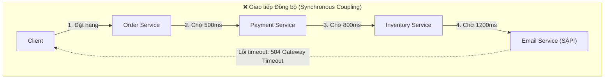
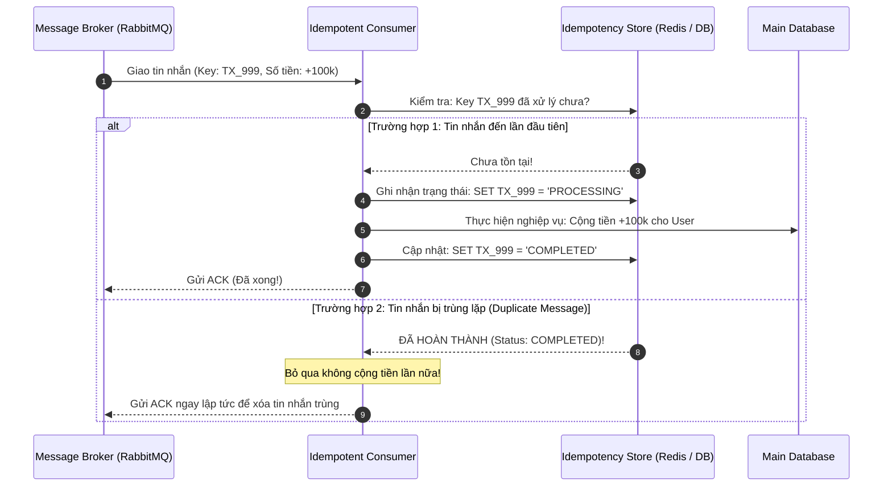
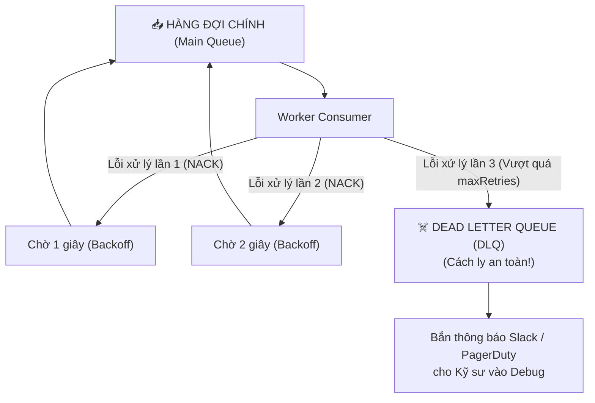

# CHUYÊN ĐỀ 07: HÀNG ĐỢI TIN NHẮN, DEAD LETTER QUEUE & MÔ HÌNH XỬ LÝ BẤT BIẾN (MESSAGE QUEUES, DLQ & IDEMPOTENT CONSUMER)

> **Mục tiêu cấp độ Senior / Architect**: Làm chủ kiến trúc Bất đồng bộ (Asynchronous Event-Driven Architecture), phân tích 3 cấp độ tin cậy giao nhận tin nhắn (*At-most-once*, *At-least-once*, *Exactly-once*), giải quyết triệt để thảm họa trùng lặp giao dịch bằng **Idempotent Consumer Pattern**, và thiết kế cơ chế xử lý tin nhắn độc hại (Poison Messages) với **Dead Letter Queue (DLQ)** và **Exponential Backoff Retry**.

---

## 1. Đồng Bộ (Synchronous) vs. Bất Đồng Bộ (Asynchronous Queuing)

Trong kiến trúc Monolith hoặc Microservices giao tiếp bằng REST API đồng bộ (Synchronous HTTP):



### Hậu quả của kiến trúc Đồng bộ:
1. **Ràng buộc thời gian (Temporal Coupling)**: Client bị "đơ" màn hình vì phải đợi toàn bộ chuỗi dịch vụ xử lý xong ($500 + 800 + 1200 = 2500\text{ ms}$).
2. **Sập dây chuyền (Cascading Failure)**: Nếu Email Service bị chậm hoặc chết, toàn bộ luồng Đặt hàng của công ty bị chết theo!
3. **Không chịu được tải bùng nổ (No Traffic Leveling)**: Khi có đợt Flash Sale $50,000\text{ req/s}$, toàn bộ backend và DB phía sau bị đè bẹp.

```mermaid
flowchart TD
    subgraph Async["✅ Giao tiếp Bất đồng bộ với Message Queue (Decoupled)"]
        direction LR
        Client2["Client"] -->|"1. Đặt hàng"| OrderAPI["Order API"]
        OrderAPI -->|"2. Đẩy tin nhắn (2ms)"| Queue[("RabbitMQ / SQS<br>(Buffer Đệm)")]
        OrderAPI -->>|"3. 202 Accepted (Xong!)"| Client2
        
        Queue -->|"Rút tin nhắn theo công suất"| Worker1["Payment Worker"]
        Queue -->|"Rút tin nhắn theo công suất"| Worker2["Inventory Worker"]
        Queue -->|"Rút tin nhắn theo công suất"| Worker3["Email Worker"]
    end
```

### Lợi ích Tuyệt đối của Message Queue:
* **Phản hồi siêu tốc**: Order API chỉ cần đẩy sự kiện vào Queue (mất 2ms) rồi trả về ngay `202 Accepted` cho khách hàng.
* **Đệm làm phẳng tải (Traffic Leveling / Throttling)**: Dù khách hàng gửi $50,000\text{ req/s}$, các Worker phía sau vẫn từ tốn rút từng đợt $500\text{ msg/s}$ để xử lý mà Database không hề bị quá tải.
* **Cách ly sự cố (Fault Isolation)**: Nếu Email Service bị sập, tin nhắn vẫn nằm an toàn trong Queue. Khi Email Service được khởi động lại, nó tiếp tục xử lý các tin nhắn tồn đọng mà không làm mất bất kỳ email nào!

---

## 2. Ba Cấp Độ Tin Cậy Giao Nhận (Message Delivery Guarantees)

Trong một hệ thống mạng phân tán không hoàn hảo:

| Cấp độ | Cơ chế hoạt động | Ưu điểm | Nhược điểm |
| :--- | :--- | :--- | :--- |
| **1. At-most-once (Tối đa một lần)** | Gửi tin nhắn đi mà **không chờ xác nhận (Fire and Forget)**. Không bao giờ gửi lại (No Retry). | Tốc độ cao nhất, không lo bị trùng tin nhắn. | **Có thể mất tin nhắn (Data Loss)** nếu mạng bị rớt gói tin hoặc Consumer sập giữa chừng. *(Dùng cho log metrics, telemetry)*. |
| **2. At-least-once (Tối thiểu một lần)** | Gửi tin nhắn kèm cơ chế **Xác nhận (ACK)**. Nếu sau thời gian chờ (ACK Timeout) mà chưa nhận được ACK, Broker sẽ **gửi lại tin nhắn (Retry)**. | **Đảm bảo 100% không bao giờ mất tin nhắn**. | **Chắc chắn sẽ có tin nhắn bị gửi trùng lặp (Duplicate Messages)!** |
| **3. Exactly-once (Đúng một lần)** | Mỗi tin nhắn chỉ được xử lý đúng một lần duy nhất. | Hoàn hảo nhất cho nghiệp vụ tài chính. | Về mặt mạng vật lý thuần túy là **bất khả thi** do định lý Two Generals' Problem. |

> [!IMPORTANT]
> **Công thức Vàng của System Architect**:
> $$\text{Exactly-Once Processing} = \text{At-Least-Once Delivery} + \text{Idempotent Consumer}$$
> Vì Broker mạng chắc chắn sẽ gửi trùng lặp tin nhắn, cách duy nhất để đạt được tính đúng đắn trong kinh doanh là **làm cho Consumer có khả năng xử lý bất biến (Idempotent)**!

---

## 3. Idempotent Consumer Pattern (Mô hình Người Tiêu Thụ Bất Biến)

### 3.1. Tính bất biến (Idempotence) là gì?
Một hàm hoặc thao tác được gọi là Idempotent nếu thực thi nó **1 lần hay 100 lần** thì kết quả trạng thái cuối cùng của hệ thống vẫn giống hệt nhau:
$$f(f(x)) = f(x)$$

* **Thao tác KHÔNG Idempotent**: `UPDATE accounts SET balance = balance + 100000`. (Nếu chạy 3 lần, khách được cộng 300,000đ $\rightarrow$ Sai lệch tài chính!).
* **Thao tác Idempotent**: `UPDATE accounts SET balance = 100000 WHERE id = 1` hoặc chèn giao dịch kèm khóa duy nhất `transaction_id = 'TX_12345'`.

---

### 3.2. Sơ đồ Hoạt động của Idempotent Consumer



---

## 4. Xử Lý Tin Nhắn Độc Hại & Dead Letter Queue (DLQ)

### 4.1. Thảm họa Poison Message (Tin nhắn có độc)
* Giả sử một tin nhắn chứa dữ liệu JSON lỗi cú pháp hoặc giá trị bị chia cho số 0 khiến Consumer ném lỗi ngoại lệ (Crash).
* Nếu Consumer từ chối tin nhắn và Broker đẩy nó ngược lại đầu hàng đợi (`NACK / Requeue = true`):
  * Consumer đọc lại $\rightarrow$ Crash tiếp $\rightarrow$ Requeue $\rightarrow$ Đọc lại $\rightarrow$ Crash...
  * **Hậu quả**: Vòng lặp vô tận (Infinite Retry Loop)! Hàng ngàn tin nhắn hợp lệ của khách hàng khác bị kẹt cứng phía sau không thể xử lý (**Head-of-Line Blocking**).



### 4.2. Chiến lược Phòng thủ Chuẩn:
1. **Giới hạn số lần thử lại (`maxRetries = 3`)**: Không bao giờ retry vô hạn.
2. **Giãn cách số mũ kết hợp ngẫu nhiên (Exponential Backoff + Jitter)**: Lần 1 thử lại sau 1s, lần 2 sau 2s, lần 3 sau 4s để hạ nhiệt áp lực lên DB/Mạng.
3. **Cách ly vào Dead Letter Queue (DLQ)**: Khi đã vượt quá số lần retry cho phép, bốc tin nhắn đó chuyển sang DLQ. Hàng đợi chính lập tức thông suốt trở lại!
