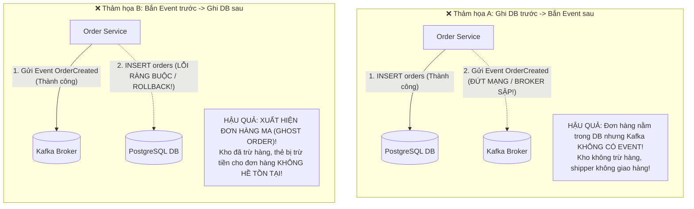
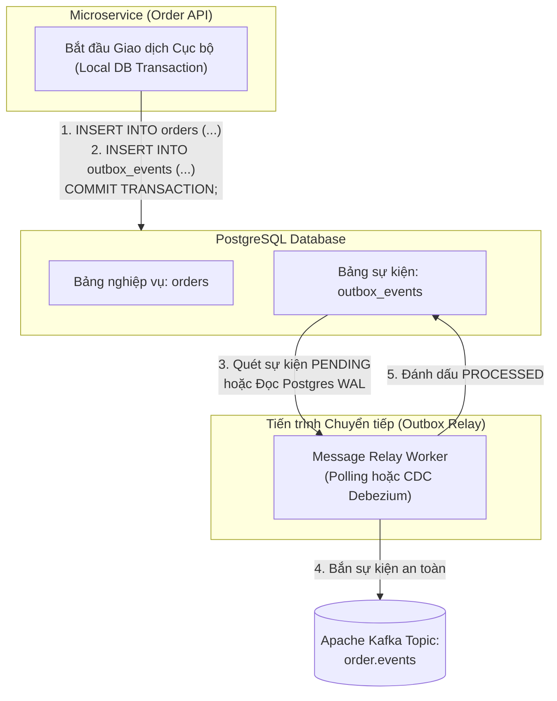

# CHUYÊN ĐỀ 08: EVENT STREAMING, CDC & TRANSACTIONAL OUTBOX PATTERN

> **Mục tiêu cấp độ Senior / Architect**: Giải quyết dứt điểm thảm họa **The Dual-Write Problem (Cơn ác mộng Ghi kép)** trong kiến trúc Microservices, hiểu lý do tại sao giao thức 2-Phase Commit (2PC) đã chết, làm chủ mô hình **Transactional Outbox Pattern** kết hợp **Change Data Capture (CDC / Debezium)**, và thiết kế luồng xuất bản sự kiện có độ tin cậy tuyệt đối (Zero Data Loss).

---

## 1. Cơn Ác Mộng "Dual-Write" trong Microservices

Trong một hệ thống phân tán, hầu hết các luồng nghiệp vụ đều đòi hỏi **hai hành động** diễn ra đồng thời:
1. Lưu trữ trạng thái mới vào Cơ sở dữ liệu nội bộ (Local Database - PostgreSQL / MySQL).
2. Phát đi một Sự kiện (Event) tới Message Broker (Kafka / RabbitMQ) để thông báo cho các dịch vụ khác (Kho hàng, Thanh toán, Vận chuyển, Email).



### Tại sao 2-Phase Commit (2PC / XA Transactions) đã lỗi thời?
Nhiều kỹ sư từng nghĩ đến việc dùng **Distributed Transactions (2PC / XA)**:
* **Bản chất 2PC**: Yêu cầu Database và Message Broker cùng tham gia vào một giao dịch 2 giai đoạn dưới sự điều phối của một Transaction Coordinator.
* **Lý do bị đào thải trong Cloud-Native**:
  1. **Hiệu năng cực kỳ kém (High Latency)**: Giao thức 2PC giữ row lock trên DB trong suốt thời gian chờ xác nhận qua mạng từ Broker.
  2. **Giao thức Blocking (Dễ gây tê liệt hệ thống)**: Nếu Coordinator bị sập giữa 2 phase, toàn bộ tài nguyên trên Database bị khóa cứng vĩnh viễn!
  3. **Không được hỗ trợ**: Các công nghệ Message Broker hiện đại (Apache Kafka, AWS SQS, Google Cloud Pub/Sub) **hoàn toàn không hỗ trợ giao thức XA/2PC**!

---

## 2. Giải Pháp Chuẩn Mực: Transactional Outbox Pattern

Ý tưởng cốt lõi của Transactional Outbox: **Đưa thao tác phát sự kiện trở thành một thao tác ghi dữ liệu bình thường nằm trong chính Database cục bộ!**



### Các Bước Thực Thi Chuẩn:
1. **Ghi nguyên tử (Atomicity)**: Khi người dùng đặt hàng, service mở một Transaction SQL:
   ```sql
   BEGIN TRANSACTION;
   -- 1. Lưu thông tin đơn hàng
   INSERT INTO orders (id, user_id, amount, status) 
   VALUES ('ORD-01', 'USR-99', 500000, 'CREATED');

   -- 2. Lưu sự kiện vào bảng outbox_events cùng một lúc!
   INSERT INTO outbox_events (id, aggregate_type, aggregate_id, event_type, payload, status)
   VALUES ('EVT-100', 'Order', 'ORD-01', 'OrderCreated', '{"amount": 500000}', 'PENDING');

   COMMIT;
   ```
   Nhờ thuộc tính **ACID** của PostgreSQL/MySQL: **Cả 2 bảng cùng được lưu thành công, hoặc cả 2 cùng bị hủy bỏ (Rollback)**. Không bao giờ xảy ra tình trạng lệch pha!

2. **Tiến trình chuyển tiếp (Message Relay)**:
   * Một tiến trình ngầm đọc các bản ghi `PENDING` trong bảng `outbox_events` và xuất bản sang Kafka.
   * Khi Kafka trả về ACK xác nhận đã nhận tin nhắn, tiến trình cập nhật `status = 'PROCESSED'` hoặc xóa bản ghi outbox.

---

## 3. Hai Cơ Chế Triển Khai Outbox Relay

| Tiêu chí | Cơ chế 1: Polling Publisher | Cơ chế 2: Change Data Capture (CDC / Debezium) |
| :--- | :--- | :--- |
| **Cơ chế hoạt động** | Một Worker Node định kỳ mỗi 100ms gửi câu query SQL: `SELECT * FROM outbox_events WHERE status = 'PENDING' FOR UPDATE SKIP LOCKED` | Debezium kết nối trực tiếp vào luồng **Write-Ahead Log (WAL)** của PostgreSQL hoặc **Binlog** của MySQL ở tầng filesystem. |
| **Tác động lên Database** | Tiêu tốn CPU và I/O của Database do phải liên tục chạy câu lệnh SELECT thăm dò (Polling). | **Gần như bằng 0**: Không chạy bất kỳ câu lệnh SQL nào trên DB. |
| **Độ trễ sự kiện (Latency)** | Phụ thuộc vào chu kỳ polling (thường từ $100\text{ms} - 1000\text{ms}$). | **Gần như tức thì (Near Real-Time)**: $5\text{ms} - 30\text{ms}$ ngay khi transaction được commit vào WAL! |
| **Độ phức tạp hạ tầng** | Cực kỳ đơn giản, chỉ cần viết một hàm Node.js / Go chạy background worker. | Phức tạp hơn: Cần cấu hình Kafka Connect, cụm Debezium và cấp quyền đọc WAL log của Database. |
| **Khuyên dùng khi nào?** | Hệ thống vừa và nhỏ, khối lượng giao dịch dưới 2,000 events/s. | Hệ thống quy mô lớn (Enterprise), hàng chục ngàn events/s. |

---

## 4. Bức Tranh Toàn Cảnh: Sự Kết Hợp Tối Thượng

Bây giờ chúng ta đã có đủ hai mảnh ghép:

$$\underbrace{\text{Transactional Outbox Pattern}}_{\text{Đảm bảo Producer KHÔNG MẤT SỰ KIỆN (At-Least-Once)}} \quad \Longrightarrow \quad \underbrace{\text{Message Broker (Kafka)}}_{\text{Đệm lưu trữ sự kiện phân tán}} \quad \Longrightarrow \quad \underbrace{\text{Idempotent Consumer (Module 07)}}_{\text{Triệt tiêu tin nhắn trùng lặp}}$$

* Nếu Outbox Relay bắn tin nhắn sang Kafka thành công, nhưng bị sập điện trước khi kịp cập nhật `status = 'PROCESSED'`:
  * Khi khởi động lại, Outbox Relay sẽ gửi lại sự kiện đó một lần nữa sang Kafka (**At-Least-Once Delivery**).
  * Consumer phía nhận (Kho hàng/Thanh toán) sử dụng **Idempotency Key (Module 07)** để phát hiện đây là sự kiện trùng lặp và bỏ qua không cộng/trừ 2 lần!
* **Kết quả**: Hệ thống đạt được **Tính đúng đắn toàn vẹn phân tán (End-to-End Exactly-Once Processing Semantics)** mà không cần bất kỳ giao thức khóa phân tán chậm chạp nào!
