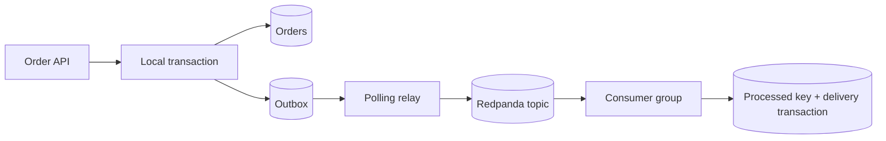

# 08 — Transactional outbox và event streaming

## Mục tiêu

Giải quyết khoảng hở giữa ghi database và publish event; phân biệt atomic local commit với delivery guarantee tới consumer. Polling lab dùng PostgreSQL/Redpanda thật, không dùng mock broker.

## Dual-write problem

Ghi DB rồi publish: broker lỗi làm order đã commit nhưng không có event. Publish rồi ghi DB: transaction DB rollback để event tham chiếu dữ liệu chưa tồn tại. Retry tùy tiện không biến hai hệ thống thành một transaction.

2PC là protocol có coordinator và prepare/commit; có thể blocking khi coordinator lỗi và tăng thời gian giữ tài nguyên. Nó vẫn tồn tại trong hệ thống có nhu cầu/hỗ trợ thích hợp, không “đã chết”. Kafka local transactions không tự atomic commit cùng PostgreSQL. Khi không có distributed transaction phù hợp, outbox là lựa chọn dễ phân tích hơn.

## Local atomicity và relay

Order và event cùng INSERT trong một PostgreSQL transaction. Relay SELECT pending `FOR UPDATE SKIP LOCKED`, publish với aggregate ID làm key, chờ ACK rồi mark processed. Nếu crash sau send trước mark, pending được gửi lại: **at-least-once**. Dữ liệu không mất trong failure model còn durable outbox/broker; không cam kết zero loss khi mất mọi disk/backup.

Consumer dedup event ID và ghi delivery cùng transaction; chỉ commit offset sau khi handler thành công. Exactly-once effect ở DB này không bao gồm gửi email hoặc gọi API ngoài; cần idempotency/reconciliation ở đích.

## Kafka concepts

Topic chia partition; ordering chỉ trong partition. Producer key cố định giúp một aggregate về cùng partition với partitioning ổn định; tăng số partition cần phân tích thay đổi routing/order. Consumer cùng group chia partition, nên một partition không dùng song song hai consumer để tăng throughput. Offset là vị trí log, không phải order ID.

Replication factor, ISR, acks và retention ảnh hưởng durability/replay. Lab Redpanda một broker, topic auto-create một partition; chưa có HA, Kafka transaction hoặc throughput đa partition. Consumer restart replay event chưa commit offset và DB dedup ngăn delivery trùng.

## Polling và CDC

Polling đơn giản, độ trễ phụ thuộc chu kỳ và backlog; query/index/row lock gây tải DB. Lab polling 300ms, batch 10, giữ transaction lock trong khi broker confirm; timeout/retry cần tránh transaction dài khi broker chậm. Có nhiều relay thì SKIP LOCKED chia batch; không hứa ordering toàn aggregate giữa relay song song mà không thêm ordering protocol.

CDC đọc WAL/binlog qua replication protocol rồi chuyển event, ví dụ Debezium Outbox Event Router. Nó vẫn tốn tài nguyên, cần snapshot, schema/change handling, offset storage, WAL retention và quyền replication. Không có một mốc event/s cố định luôn đúng để chuyển polling sang CDC. Bản này chỉ giải thích CDC, chưa triển khai connector.

## Lab và tiêu chí đạt

[Lab 08](../labs/module-08-outbox-kafka/) kiểm tra broker offline vẫn commit order/outbox; start broker relay gửi pending; crash ngay sau publish để event gửi lại; `deliveries`/`processed_messages` vẫn đúng số event unique. Kiểm tra trực tiếp PostgreSQL, không gọi event là “emitted” chỉ vì outbox row tồn tại.

Bài tập: consumer cần cập nhật search index nhưng event về sai thứ tự. Thiết kế aggregate version và conditional update; mô tả replay từ log/rebuild từ source of truth. Tiêu chí đạt: hiểu outbox atomicity cục bộ, at-least-once delivery và phạm vi dedup.

Nguồn: [Kafka design và delivery semantics](https://kafka.apache.org/design/), [Debezium outbox router](https://debezium.io/documentation/reference/stable/transformations/outbox-event-router.html), [PostgreSQL SKIP LOCKED](https://www.postgresql.org/docs/16/sql-select.html).
