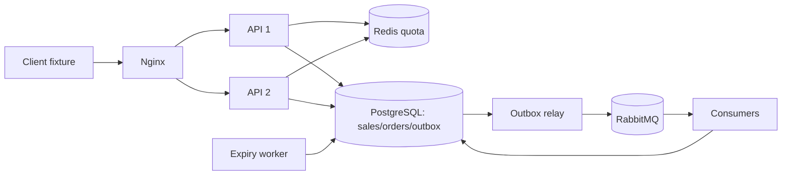

# 09 — Flash sale: transaction, reservation và phục hồi

## Yêu cầu và giới hạn

Fixture: 50 vé, 1.000 người tranh mua, mỗi tài khoản một reservation cho một sale; quantity luôn bằng 1. Reservation tồn tại 10 phút, sau đó hủy và hoàn kho nếu chưa thanh toán. Người từng có reservation bị hủy không được đặt lại trong cùng sale — lựa chọn cố ý để unique `(sale_id,user_id)` giữ quy tắc đơn giản.

API phải không bán vượt kho, retry cùng idempotency key phải trả cùng đơn, restart API không mất dữ liệu. Mục tiêu lab là tính đúng đắn và recovery trên một Docker host. Throughput/p99 phải đo trên máy thực; không cam kết 100.000 QPS hoặc 50ms.

## Kiến trúc



PostgreSQL quyết định tồn kho; Redis không nằm trong transaction đặt vé và không quyết định số vé đã bán. Single-node database/broker vẫn là SPOF. Hệ thống này có state ở tầng lưu trữ và app node không giữ state nghiệp vụ cục bộ.

## API và schema

- `POST /api/flash-sale/buy`: header `Idempotency-Key`; body `{userId:"buyer_1", itemId:"ticket_vip_blackpink", quantity:1}`. Đây là danh tính fixture, không phải authentication production.
- Mua mới trả 202 `{orderId,status:"PENDING_PAYMENT",replay:false}` sau commit. Replay trả 200 cùng order ID và trạng thái hiện tại. 202 không có nghĩa đã thanh toán hay đã gửi thông báo.
- Sai body/quantity trả 400; hết kho, user trùng hoặc key khác payload trả 409; quota 5 req/s capacity 5 trả 429; Redis/PostgreSQL lỗi trả 503.
- `GET /api/flash-sale/order/:id` đọc PostgreSQL; không tồn tại trả 404.
- `POST /api/flash-sale/order/:id/pay` thanh toán **giả lập**, transition sang PAID nếu chưa hết hạn; gọi lặp không tạo payment event thứ hai. Hết hạn/cancelled trả 409.
- `GET /api/flash-sale/product/:itemId` đọc tồn kho chuẩn từ PostgreSQL. `GET /api/system/status` trả snapshot bằng một SQL statement.

`orders` có UUID PK, unique idempotency key, request hash, unique `(sale_id,user_id)`, CHECK quantity=1 và trạng thái hợp lệ. `sales` có CHECK `0<=stock<=initial_stock`. `outbox`, `processed_messages`, `deliveries` lưu event/dedup bền vững.

## Transaction boundary

1. Advisory transaction lock theo idempotency key để serialize retry giữa app node.
2. Nếu key đã tồn tại: đối chiếu hash payload, trả cùng đơn hoặc conflict.
3. `UPDATE sales SET stock=stock-1 WHERE id=$1 AND stock>0 RETURNING stock`.
4. INSERT order và outbox trong cùng transaction, COMMIT rồi trả client.

Unique violation rollback cả decrement. Timeout sau commit không biết kết quả ở client; retry cùng key đọc lại order. Row contention được giới hạn bởi pool và timeout; PostgreSQL có thể là bottleneck. Với tải lớn cần đo admission control, waiting room và partition theo sale; không thay đổi nguồn dữ liệu chuẩn chỉ vì Redis nhanh hơn.

## Sự kiện và failure windows

Relay đọc outbox bằng `FOR UPDATE SKIP LOCKED`, publish persistent message, chờ publisher confirm rồi đánh dấu PROCESSED. Broker outage để event PENDING. Crash sau publish trước mark tạo duplicate: đây là **at-least-once**, không tuyên bố exactly-once transport.

Consumer INSERT processed key và delivery trong cùng transaction, sau đó ACK. Crash sau commit trước ACK dẫn tới redelivery; unique processed key ngăn tác dụng nghiệp vụ trùng. Consumer retry tối đa ba lần xử lý, rồi DLQ; cần điều tra/replay thủ công, không tự khẳng định mọi poison message được xử lý thành công.

Expiry worker conditional update những order PENDING_PAYMENT đã hết hạn, khóa theo batch; cùng transaction hoàn stock và ghi cancellation event. Payment cũng conditional update cùng row. Chỉ một transition thắng; chạy expiry nhiều lần không hoàn kho lặp. Consumer không gửi email/thanh toán thật: `deliveries` là kết quả xử lý event trong DB.

## Chạy và kiểm tra

```bash
npm run lab:up -- 09
npm run lab:test -- 09
REQUESTS=1000 CONCURRENCY=30 npm run lab:benchmark -- 09
npm run lab:down -- 09
```

`RESERVATION_TTL_SECONDS=2 npm run lab:up -- 09` dùng TTL ngắn cho thí nghiệm riêng; integration test chuẩn dùng mặc định 600 giây và thay expires_at từng order cần kiểm tra.

Invariants: `stock + count(order status != CANCELLED) = initial_stock`; không quantity khác 1; không trùng user/sale; mỗi event có tối đa một delivery. Test đọc DB trực tiếp, chạy hai API node, broker outage, Redis outage, restart và expiration/payment.

## Bài tập và đánh đổi

Thử stop PostgreSQL rồi gửi request: API từ chối thay vì tự lưu RAM. Phân tích cần replication/backup/PITR và election nào để chịu lỗi database host. Thiết kế waiting room để bảo vệ hot row; đo thành công, từ chối, latency và pool wait riêng.

Nguồn: [PostgreSQL concurrency](https://www.postgresql.org/docs/16/mvcc.html), [RabbitMQ confirms](https://www.rabbitmq.com/docs/confirms), [Redis Sentinel limitations](https://redis.io/docs/latest/operate/oss_and_stack/management/sentinel/).
