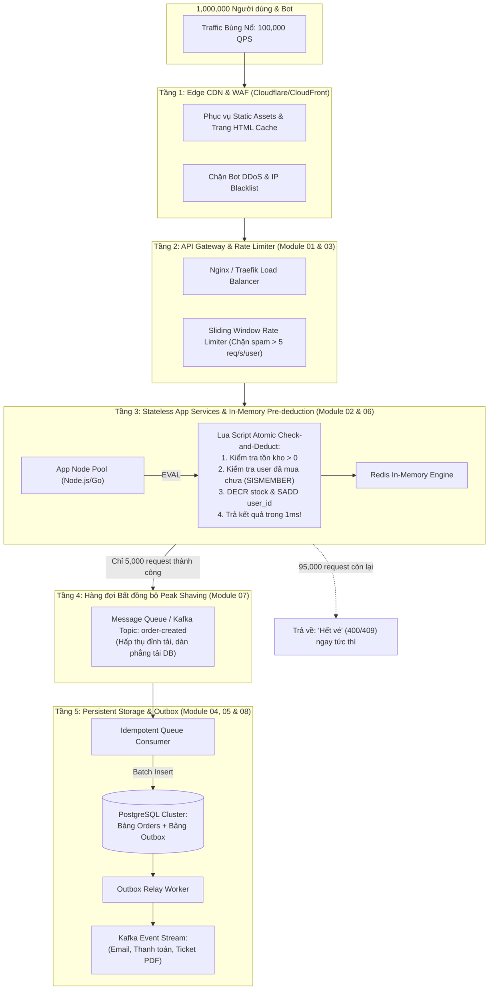

# 🏛️ Đồ Án Tổng Hợp: Kiến Trúc Flash Sale & Săn Vé Chịu Tải Cực Hạn (100,000+ QPS)

> **Cấp độ:** Senior & Principal System Architect Track  
> **Chủ đề:** End-to-End High-Concurrency Ticket Booking / Flash Sale Architecture  
> **Mục tiêu:** Tích hợp toàn diện các kỹ thuật từ Module 01 đến Module 08 để xây dựng hệ thống chịu hàng trăm nghìn lượt tranh mua đồng thời, phản hồi siêu tốc dưới 50ms, và đảm bảo **tuyệt đối không bán âm kho (Zero Overselling)**.

---

## 1. Bài toán Thực tế & Yêu cầu Hệ thống

### 1.1. Bối cảnh Kinh doanh
Một nền tảng bán vé độc quyền mở bán **5,000 vé** cho buổi hòa nhạc của ca sĩ nổi tiếng lúc **12:00:00 trưa**.
- Ước tính có **1,000,000 người dùng** túc trực trước màn hình.
- Đúng 12:00:00, lượng truy cập đồng thời bùng nổ lên tới **100,000 requests/giây (QPS)**.
- Mỗi người dùng chỉ được phép mua tối đa **1 vé**.
- Nếu hệ thống bị sập (502 Bad Gateway), bán quá 5,000 vé (Overselling), hoặc dữ liệu trừ tiền nhưng không xuất được vé (Data Inconsistency), doanh nghiệp sẽ chịu thiệt hại hàng triệu USD và khủng hoảng truyền thông nghiêm trọng.

### 1.2. Mục tiêu Kỹ thuật (SLO / SLA)
| Chỉ số | Mục tiêu yêu cầu |
| :--- | :--- |
| **Peak Throughput** | Xử lý mượt mà đỉnh tải $\ge 100,000 \text{ QPS}$ |
| **Latency (p99)** | Thời gian phản hồi cho client $< 50 \text{ ms}$ |
| **Inventory Integrity** | **Tuyệt đối không bán âm** ($\text{Tồn kho bán ra} = \text{Tồn kho thực tế}$) |
| **User Fairness & Anti-cheat** | Chặn bot, mỗi User ID chỉ thành công tối đa 1 đơn hàng |
| **Database Protection** | Cơ sở dữ liệu quan hệ (PostgreSQL) không bị quá tải sập kết nối (Connection Pool Exhaustion) |
| **Event Reliability** | 100% Đơn hàng thành công đều phát sinh Event gửi email/vé (Zero Event Loss) |

---

## 2. Ước tính Năng lực Hệ thống (Capacity Estimation)

### 2.1. Tính toán Băng thông & QPS
- **Số lượng request tại thời điểm đỉnh tải (Peak QPS):** $100,000 \text{ QPS}$.
- **Kích thước một request mua vé (Payload):**
  $$\text{Payload} \approx 500 \text{ bytes (JSON + HTTP Headers + Auth Token)}$$
- **Băng thông mạng vào (Inbound Bandwidth):**
  $$100,000 \times 500 \text{ bytes} = 50,000,000 \text{ B/s} \approx 50 \text{ MB/s} = 400 \text{ Mbps}$$
- **Kích thước một response (JSON):**
  $$\text{Response} \approx 300 \text{ bytes}$$
- **Băng thông mạng ra (Outbound Bandwidth):**
  $$100,000 \times 300 \text{ bytes} \approx 30 \text{ MB/s} = 240 \text{ Mbps}$$
*(Băng thông nằm trong tầm kiểm soát của mạng 10Gbps tại Cloud Data Center).*

### 2.2. Phân tích Nút thắt Database (The DB Bottleneck)
- Nếu **100,000 request/giây** cùng lúc chạy câu lệnh SQL ghi:
  ```sql
  BEGIN;
  SELECT stock FROM tickets WHERE event_id = 101 FOR UPDATE; -- KHÓA DÒNG B-TREE!
  UPDATE tickets SET stock = stock - 1 WHERE event_id = 101;
  INSERT INTO orders (...) VALUES (...);
  COMMIT;
  ```
- **Hậu quả:** 100,000 transaction cùng tranh chấp Row Lock trên đúng 1 bản ghi của event 101!
  - Postgres Max Connections thường chỉ từ 200 - 1000 connections.
  - Hàng chục nghìn connection bị xếp hàng chờ lock timeout.
  - CPU máy chủ DB nhảy vọt lên 100% vì context switching và lock contention.
  - **Hệ thống sập hoàn toàn chỉ sau 2 giây!**

👉 **Kết luận Kiến trúc:** **Cơ sở dữ liệu quan hệ (PostgreSQL) TUYỆT ĐỐI KHÔNG ĐƯỢC ĐỨNG Ở TUYẾN ĐẦU của luồng trừ tồn kho!**

---

## 3. Kiến trúc Đa Tầng: Mô hình "Phễu Lọc Tải" (Traffic Funnel)

Để bảo vệ Database và đảm bảo độ trễ $< 50\text{ms}$, hệ thống áp dụng mô hình phễu lọc giảm tải từng cấp:



### Chi tiết các tầng bảo vệ:

| Tầng | Công nghệ / Kỹ thuật | Trách nhiệm | Tải còn lại chuyển tiếp |
| :--- | :--- | :--- | :--- |
| **Tầng 1: Edge CDN** | Cloudflare / Fastly | Trả HTML/JS tĩnh, Cache-Control header, chặn DDoS cơ bản | $100,000 \rightarrow 80,000 \text{ QPS}$ |
| **Tầng 2: Rate Limiter** | Nginx + Token Bucket / Redis Sliding Window | Loại bỏ spam, hạn chế mỗi user chỉ gửi tối đa 5 req/s | $80,000 \rightarrow 30,000 \text{ QPS}$ |
| **Tầng 3: In-Memory Pre-deduction** | Redis + Lua Script Atomic Execution | **Kiểm tra tồn kho & trừ trước trên RAM (1ms)**. Kiểm tra mỗi user chỉ mua 1 lần | **Chỉ đúng 5,000 requests lọt qua!** $95,000$ request bị từ chối trả về ngay |
| **Tầng 4: Async Queue Buffer** | RabbitMQ / Kafka / BullMQ | Nhận 5,000 đơn thành công từ RAM, xếp hàng xử lý ghi đĩa | Dàn phẳng lưu lượng ghi DB từ $5,000 \text{ QPS} \rightarrow 500 \text{ QPS}$ ổn định |
| **Tầng 5: ACID Persistence & Outbox** | PostgreSQL + Transactional Outbox | Ghi đơn hàng vĩnh viễn, phát sinh sự kiện xuất vé đảm bảo 100% không mất dữ liệu | Lưu trữ an toàn, hoàn tất chu kỳ mua hàng |

---

## 4. Trọng Tâm Kỹ Thuật: Atomic Pre-deduction với Redis Lua Script

Để đạt tốc độ 1ms mà không bao giờ bị Race Condition hay bán âm kho, chúng ta đóng gói toàn bộ logic phán quyết vào **một Redis Lua script thực thi nguyên tử (Atomic)**:

```lua
-- KEYS[1]: Key tồn kho sản phẩm (ví dụ: "flashsale:stock:event_101")
-- KEYS[2]: Set lưu danh sách user đã mua (ví dụ: "flashsale:buyers:event_101")
-- ARGV[1]: User ID người mua (ví dụ: "usr_9981")
-- ARGV[2]: Số lượng cần mua (mặc định: 1)

local stock_key = KEYS[1]
local buyers_key = KEYS[2]
local user_id = ARGV[1]
local qty = tonumber(ARGV[2])

-- 1. Kiểm tra User đã mua vé trước đó chưa (Chống đầu cơ / spam click)
if redis.call('SISMEMBER', buyers_key, user_id) == 1 then
    return -1 -- Lỗi: Mỗi khách hàng chỉ được mua 1 vé!
end

-- 2. Kiểm tra tồn kho hiện tại
local current_stock = tonumber(redis.call('GET', stock_key) or 0)
if current_stock < qty then
    return 0 -- Lỗi: Đã hết vé!
end

-- 3. Trừ tồn kho và ghi nhận User đã mua (Atomic Execution)
redis.call('DECRBY', stock_key, qty)
redis.call('SADD', buyers_key, user_id)

-- 4. Trả về số lượng tồn kho còn lại
return current_stock - qty
```

### Tại sao kiến trúc này tối ưu vượt bậc?
1. **Đơn luồng tuyệt đối (Single-threaded):** Redis thực thi Lua script nguyên khối, không có bất kỳ lệnh nào khác chen ngang giữa chừng. Không cần cơ chế khóa nặng nề.
2. **Không Round-trip qua mạng:** Kiểm tra tồn kho, kiểm tra user trùng, và trừ vé diễn ra ngay trên bộ nhớ RAM của Redis server với độ trễ $\le 1\text{ms}$.
3. **Phản hồi tức thì:** $99.9\%$ người dùng không mua được vé sẽ nhận ngay kết quả "Hết vé" trong $< 20\text{ms}$ mà không tạo ra bất kỳ áp lực nào lên Database!

---

## 5. Xử lý Sự cố & Các Góc Khuất Biên (Edge Cases & Failure Recovery)

### 5.1. Khách hàng Giữ vé nhưng Không Thanh toán (Stock Compensation / Rollback)
- **Vấn đề:** Sau khi trừ tồn kho ảo trên Redis và tạo đơn hàng, khách hàng có **10 phút** để thanh toán. Nếu sau 10 phút khách không trả tiền, vé bị treo và lãng phí!
- **Giải pháp: Delayed Message / TTL Compensation Worker:**
  ```mermaid
  sequenceDiagram
      autonumber
      actor Client as Khách hàng
      participant App as Order Service
      participant Redis as In-Memory Inventory
      participant DelayQueue as Delayed Queue (10 mins)
      participant Worker as Expiration Worker
      participant DB as PostgreSQL

      Client->>App: Mua vé thành công (Giữ chỗ)
      App->>Redis: Trừ tồn kho ảo (Lua)
      App->>DelayQueue: Đẩy Message với delay 600 giây (orderId)
      Note over Client,DelayQueue: Sau 10 phút...
      DelayQueue->>Worker: Kích hoạt kiểm tra đơn hàng
      Worker->>DB: SELECT status FROM orders WHERE id = orderId
      alt Đơn hàng chưa thanh toán (PENDING)
          Worker->>DB: UPDATE orders SET status = 'CANCELLED'
          Worker->>Redis: INCRBY stock 1 & SREM buyers user_id (Hoàn tồn kho!)
      else Đơn hàng đã thanh toán (PAID)
          Worker->>Worker: Bỏ qua (Đã hoàn tất)
      end
  ```

### 5.2. Sự cố Redis Sập Nguồn Giữa Chừng
- Nếu Redis Master bị sập trong lúc Flash Sale đang diễn ra:
  1. **Redis Sentinel / Redis Cluster:** Tự động Failover sang Replica trong $< 3$ giây.
  2. **AOF Persistence (`appendfsync everysec`):** Đảm bảo mất mát dữ liệu trên RAM tối đa chỉ trong vòng 1 giây.
  3. **Check-and-Sync với DB:** Khi hệ thống khởi động lại, đối chiếu số đơn hàng đã ghi nhận trong bảng `orders` của PostgreSQL để đồng bộ lại con số tồn kho trên Redis.

---

## 6. Tổng kết Sơ đồ Dòng Dữ liệu Toàn Hệ thống

```text
[100,000 Requests/s]
        │
        ▼ (Tầng 1 & 2: WAF + Rate Limiter)
[Lọc bỏ 70% Spam / Bot] ─── Trả về HTTP 429 Too Many Requests
        │
        ▼ (Tầng 3: Redis In-Memory Lua)
[Thẩm định Tồn kho & Trừ vé] ─── Trả về HTTP 400 Out of Stock (Khi vé đã hết)
        │
        ▼ (Chỉ đúng 5,000 vé được chấp thuận)
[Đẩy vào Message Queue Buffer] ─── Trả về HTTP 202 Accepted { orderId, status: "PROCESSING" }
        │
        ▼ (Tầng 4 & 5: Background Batch Consumer)
[PostgreSQL Insert Orders + Outbox Event] ─── Commit ACID Database
        │
        ▼ (Outbox Relay)
[Kafka Event Stream] ─── Notification, Xuất PDF Vé, Hóa đơn VAT
```

Kiến trúc này đảm bảo 3 nguyên lý sống còn của Hệ thống Chịu tải Cực hạn:
1. **Fast-Fail Early:** Từ chối yêu cầu không hợp lệ càng sớm càng tốt tại các tầng ngoài cùng của phễu.
2. **In-Memory Concurrency Decision:** Không bao giờ để Database quan hệ giải quyết tranh chấp tồn kho dưới tải cao.
3. **Asynchronous Decoupling & Guaranteed Delivery:** Tách rời luồng tiếp nhận nhanh (202 Accepted) khỏi luồng ghi đĩa nặng thông qua Message Queue và Transactional Outbox.
